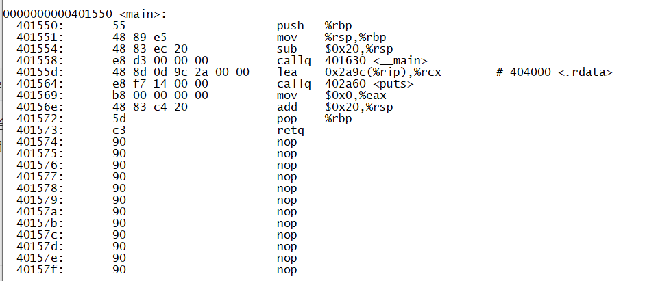

简简单单以我的理解写一下逆向工程的入门方法。

## 0x00 什么是逆向工程

什么是逆向？ 通俗来讲，计算机科学中的逆向工程就是将机器才能够懂的机器代码（二进制代码）**翻译成人能够读懂的代码**（汇编代码，C语言代码），并在此基础上分析出程序的**工作流程**。

### 举个例子

先从一开始最先接触的C语言开始。

写一个C语言程序

```c
//example1.c
#include <stdio.h>

int main(void){
    puts("Welcome to the world of Re");

    return 0;
}
```

使用`gcc`或者其他编译器或者IDE编译

```
gcc example1.c -o example1.exe
```

`gcc`实际上主要是`Linux`等类`Unix`平台的开源编译器，但是`Windows`平台上也有阉割版`gcc`，又称`mingw`。我这里使用的就是`mingw`。

然后用`objdump`把程序进行反汇编：

```
objdump -S example1.exe > dump.txt
```

得到的`dump.txt`里面反汇编了不少启动函数，不管，直接找到`main()`主函数。



这个就是我们编译出来的代码的汇编语言。

虽然现在有`ghidra`，`ida`这种高级反汇编工具能生成和源码很接近的伪C代码，但是作为逆向工程的基础，汇编语言还是很重要的，还是需要尝试去阅读，分析这种格式的汇编代码。

仅仅简单扯一下，这里详细的知识点就不讲了。

## 0x01 前置技能

入门需要的技能：

1. C语言代码审计能力（入门时期最重要的技能）
2. 调试能力
3. 汇编语言能力：通常是x86-64架构指令，毕竟大部分用户笔记本电脑，Windows系统都是基于这个架构的CPU的。

## 0x02 CTF-Re快速入门

**刷题！！！！**

刷题平台：buuoj，攻防世界，ctfshow。。。

入门期间，最好保持每天1题的频率。在刷题的时候，顺便学习知识。

实在做不出来，可以在网上查别人的write up（简称wp），也就是解题思路。可以多查几个wp，毕竟不同人写的wp的详细程度层次不齐。

就我个人而言，我在buuoj上暂时刷了5-6页的题目。后面开始慢慢地正式的打比赛，于是buuoj上面的老题也就不刷了。

## 0x03 推荐书籍

入门时期，书籍其实是不怎么推荐的。深入研究的时候就很重要了。

不过我还是跟风推荐一下我喜欢/看过的书籍。

1. CSAPP: 理论上应该是大一上学期《计算机导论》的教科书的，不少高质量高校用的都是这本书，而不是给外行人看的某《计算机文化》。讲的很全，但是书很厚，我猜友友们应该没这么多时间细读。bilibili上面有一个up主在做CSAPP的教学视频，叫做**九曲阑干**，有兴趣就去学学。
2. x86从实模式到保护模式：前一大半写16位汇编知识，也就是DOS时代的**实模式**汇编；后面开始写32位以及64位**保护模式**的汇编
3. 程序员的自我修养——链接、装载与库：介绍了 C 源代码如何经过一系列的操作最终变为二进制程序。
4. **C primer plus**：C语言学习书籍。讲的比较详细。对于一些比较偏的语法，或者比较新的语法特性，就没必要看了。
5. C++反汇编与逆向分析：经典的一本书籍，江湖人称**小黄书**，因为封面是很亮的黄色。第一版书籍中的C++代码，都是基于VC++6.0编译器的。最近新出第二版，建议过一会儿等京东打折后入手。
6. 逆向工程核心原理：Windows逆向书籍，里面详细介绍了dll注入，PE文件结构等内容。
7. Intel Developer Manual：x86CPU架构全集，百科全书，详细的描述了x86架构。我上次下载下来，用于查一些比较偏的指令。Intel官方网上有pdf，直接下载来看就好了。

## 0x04 推荐资源

### 教程类 

1. [ctf-wiki](https://ctf-wiki.org/)：入门知识快速了解。
2. bilibili上面应该有不少CTF逆向的解题视频。当然一堆时长超级长的什么游戏逆向，Windows逆向什么的视频，虽然属于是逆向工程，但是与CTF没什么关系，就别看了，专注于CTF题解。
3. 谷歌上多搜搜别人的博客。（百度就算了，避坑CSDN）

### 刷题类 

1. [攻防世界](https://adworld.xctf.org.cn/task)：有很多适合新手的题
2. [buuoj](https://buuoj.cn/)：有大量比赛题。这个平台还会每月举办月赛，可以关注一下。

### 比赛类 

1. [ctftime](https://ctftime.org/)：国际的高质量赛事
2. [ctfhub](https://www.ctfhub.com/#/calendar)：国内外赛事，可以订阅一下日历
3. ctfshow：一大堆各个方向的入门题，非常非常适合入门。

## 0x05 工具

先讲一下我经常用到的工具吧。

### 反汇编工具

#### IDA

现在已知最好的商业用户态反编译器。单人直接购置比较昂贵。可以选择组团购买（有钱佬或者追求最新版本的人可以考虑）。或者选择网上的破解过的老版本。

`IDA`支持多种架构，在主流架构中，比如`x86`,`x64`,`arm`,`arm64`等都支持反编译，即将汇编代码还原回C伪代码。较新的7.5版本也支持了对`mips`架构的反汇编。

`IDA`支持插件拓展，以提升工作效率。我个人觉得比较好的有`Keypatch`插件，用于快速对代码进行打补丁；`PyIDA`插件，提供了一个基于`IPython`的交互式界面，写`IDAPython`代码更有效率；`FindCrypt`，根据密码算法的特征码识别主流加密算法。

如上所述`IDA`有一个`IDAPython`脚本语言环境作为额外支持，这能够使得用户快速写出便捷的脚本，实现自动化。

#### Ghidra

NSA美国国家安全局的开源用户态反编译器。在`Github`上面能找到。功能也很强大，而且开源，想深入研究反编译原理的可以考虑去阅读`Ghidra`的源码。（没试过但大为震撼）

而且`Ghidra`早已支持`mips`架构的反编译，非常有优势。

#### Ollydbg

Windows平台下祖传的32位程序用户态**动态**调试器。在`IDA`还没有因为泄露版而爆火之前，`Od`是最常用的反汇编工具。`Ollydbg`因为有良好的社区以及众多的用户支撑，所以它有很多插件可供使用。

可以选择在**吾爱破解**网站上下载由各位大佬魔改，加过插件后的`Ollydbg`版本。

#### x64dbg/x32dbg

也是Windows平台下的用户态调试器。其`x64dbg`弥补了`Ollydbg`只能调试32位程序而无法调试64位程序的缺陷。

#### gdb

Linux平台上最常用的调试器。功能强大，是pwn👴的最爱。

调试Linux程序的时候可以选择使用该工具。

当然其特点是，它是一个命令行工具，而刚刚介绍的都是Windows平台上的图形化调试器，所以可能需要一段时间熟悉操作指令。

调试Linux程序，也可以使用`IDA`远程调试。

#### jeb3

这其实也是一个全能型商业反汇编器，但是由于其他架构的支持有点拉跨，所以通常用于分析**安卓应用**。

付费软件。

#### Windbg

Windows专业调试器。有内核态和用户态两种模式。十分万能。内核态调试器也不算多，所以windbg算是十分厉害的工具了。

对于内核态和用户态两类调试器的区别，可以暂且简单认为内核态更厉害，速度也更快，毕竟需要管理员权限才能使用；而用户态调试器仅仅调用了系统允许使用的普通API，有不少局限性。

#### dnspy

.Net程序分析工具。很好用。

### 实用脚本工具

Github上面有很多工具可供使用。谈谈我经常用的。

这些工具通常都是基于python的，可以快速写出一个解题脚本。

#### z3

微软实验室推出的SMT求解器。近年来开源了，可以在GitHub上面找到。

z3简单来说就是一个用于解方程的工具。

虽然也有局限性，但是z3确实能够解决挺多的基于算法的CTF题。z3自带的例子就有八皇后问题，幻方等经典算法谜题求解脚本。

z3也是angr和triton底层的约束求解器。

[z3py api guide | (*´∇｀*) Wuuuudle Blog](https://www.wuuuudle.cn/2020/07/23/z3py-api-guide/)吴师傅的博客，可以作为学习参考。

#### capstone

开源反汇编器。支持多个架构。

有利于快速获得一些小片字节码的汇编代码。

capstone算是支持指令集最多的反汇编器了。`IDA`有些会识别错误的指令，capstone都能正常反汇编出来。

#### keystone

开源编译器。支持多个架构。

有利于快速从小片汇编代码中编译出字节码，而不需要像`gcc`编译器那样需要一个完整的程序声明。

keystone也是IDA插件keypatch的底层。

#### angr

虽然是一个比较全能的二进制分析框架，但是对于大部分使用人员来说，它还是用于”符号执行“的工具。

利用”符号执行“，`angr`能够解决不少简单的CTF逆向题。

符号执行是一个程序分析理论，后面会讲。

#### triton

triton是一位法国佬写的，一开始是基于pintools的**动态**符号执行二进制程序分析框架。

是一个比较新兴的工具，作者也在积极更新。有兴趣的话可以去看看他的博客。

作者的名字叫做Jonathan Salwan。

#### unicorn

一个基于qemu的CPU模拟器，支持x64，x86，powerpc，mips，arm，arm64等多个平台。用于模拟执行程序，能够弥补很多动态调试器的缺陷。

#### miasm

一个二进制分析框架。稍微老了一点，但还是挺好用的。

#### qemu

架构模拟器。可以跨平台模拟程序。比如可以在x86平台的Linux上模拟arm Linux程序。

#### qiling

基于Unicorn的工具。Unicorn作为单纯的CPU模拟器，不能处理系统调用，异常处理等一些基于系统的功能；而qiling在Unicorn的基础上尝试模拟系统调用等功能，实现了一个真正的对程序的模拟运行。

比较新兴的工具，好像还是国人写的工具。

#### Crypto库

密码学库，内含多个现代密码学算法。可以用于解不魔改情况下的现代密码学加密题。

Re出密码题通常只出现代密码学题，但通常少不了魔改，在魔改情况下就无法使用了，只能用自己写的解密脚本去解题。

#### Frida/xposed

安卓方向比较常用的分析框架。

### 其他

#### pin

Intel提供的一个插桩工具。其内核的实现方式不开源，但是Intel提供了编写pintools的API。

pin和pintools是两个概念。pin是底层，由Intel提供，本质是一个虚拟机；pintools是由用户编写的，基于pin的工具。具体的描述比较复杂，编写pintools也需要一定技巧，所以不再赘述。以后我会继续更新关于pintools的博客。

最常用的pintools是指令计数工具，能够根据指令数分析程序效率。基于**侧信道攻击理论**，指令计数工具能用于爆破CTF的简单题flag，或者猜测输入字符串长度。

triton作者对于pintools编写是有一手的。可以看看它的博客。

#### 程序性质检查工具

遇到题目，通常先要知道这是什么架构的，什么位数的，可能加过什么壳。

DIE，PEiD就是这种Windows平台上的检查工具。

我通常用的是DIE，能应付大多数要求，但是有些老的保护壳还是有可能查不出来。

#### WindowsPE文件分析工具

CFF explorer, DIE, lord PE...

吾爱破解上有个工具库，这些都有。

不过由于我还没很深入的分析Windows程序文件，大多数工具也仅仅是了解,或者用过一两次，不够熟练。

## 0x02 理论

### 程序分析理论

程序分析通常分为**静态分析**和**动态分析**。

#### 静态分析

使用IDA等工具直接嗯看伪代码，来观察其大致的总体逻辑。

**优势：**静态分析能够快速探索多个分支（反正是肉眼看，想跳到哪里就跳到哪儿），获得大致的程序流程。

**缺点：**没法获得CPU的实际内容，有可能存在误分析的情况；在被加壳，代码混淆，程序流混淆的情况下，静态分析变得尤其困难。

#### 动态分析

使用ollydbg等调试器，在调试状态下，对一个实际的程序路径进行分析。

**优势：**能获得实际的CPU内容，便于了解真正的程序状态。动态分析可以获得内存中的实际内容，比静态分析中的静态字节码更有真实性：加壳程序，混淆程序的实际程序流程大都可以在调试的过程中摸清。动态调试脱壳也是一种常见手法。

**缺点：**只能局限于一个程序执行流；遇到反调试，异常处理等手段下难以动态调试。

实际分析中，都是动静态同时使用的。

### SAT/SMT理论

z3的底层理论，十分的离散数学。

入门时不需要了解，只要会使用z3梭哈题目就行了。

## 0x04 目前遇到的题目类型

本节谈谈现在比赛里遇到的各种题型。

### 虚拟机

虚拟机的简单理解，就是机器套机器，一种套娃行为。

其本质就是实现一个作者自己实现的迫真指令集，然后基于这个指令集实现操作。

虚拟机这个理念，最有名的实现，就是一个很恶俗的壳，叫做VMP。

buuoj上经典题目就是`EzMachine`，有兴趣可以去查查。

### 现代密码学加密

入门时最容易遇到的加密题就是基于base64及其变体的题目。不过base64实际上不是加密，其实就是一个编码方式。

正经比赛里的现代密码学加密题，包括但不局限于：TEA家族算法，RC4流密码，AES及其变体，DES及其变体。。。

偶尔还会出一些少见的密码，比如Chacha20，Salsa20，ECC非对称椭圆加密，甚至用gmp大数运算库实现RSA。非对称加密算法通常都是标准的，不会有什么魔改，也没有什么攻击要求，不像密码方向的题目。

面对现代密码学加密，最好要提前，一个密码类型一个密码类型的去了解这个密码的加密流程，并尝试自己本地写一份能快速编译通过，快速使用的密码算法样本。这样能让你在比赛时节省不少时间。

### Python

#### Py脚本

这个比较简单，入门时可能会遇到。可能会配合代码混淆，或者虚拟机一起出现。

#### Pyc字节码

Py脚本编译成Pyc字节码文件。最好了解一下**Python栈虚拟机实现**，以及Python的汇编语言。

由Pyc字节码得到汇编，可以使用python自带的Pydisasm程序进行反汇编。

Github上面也有不少反编译工具，能够直接将Pyc反编译成Py源代码。但是貌似没几个支持3.9及其以上的高版本的，所以学会读Python汇编还是一个很重要的技能。

哦对，还要了解Pyc字节码文件的结构。反正很简单。

#### Pyd编译文件

这是最恶心的题目，需要你读Cython自动生成的代码。Windows平台下用mingw编译出来的Pyd是最恶心的，没有调试信息。Linux平台下编译出so文件，至少还是有调试信息的。遇到这种题目，建议放到最后去看，因为大概率会看自闭。

#### Pyinstaller打包程序

利用Pyinstaller打包后的exe程序。Github上面有几个解包工具，解包后，会得到一大坨的库文件，以及关键的程序文件。

通常解包后会得到Pyc文件，但是是缺损头部信息的，需要使用配套的struct文件进行复原。

具体不细说，反正就是要去了解Pyc字节码文件结构。

### Go

Go语言也是一个很恶俗的语言。IDA的反编译器生成的代码不精确，最多作为参考。

需要了解Go语言的内存模型，调用约定等东西。以后我会整理一下知识点的。

### Rust

纯纯的不会，和Go一样恶俗。

### 算法谜题

一些小游戏一样的感觉。

八皇后谜题，跳棋，走迷宫。。。

建议学习DFS，BFS或者A*走迷宫算法，或者尝试用z3解题。

### .Net

用dnspy去分析.Net题。核心是C#。

### Android

安卓apk逆向题。这是一个很大的方向，且一些混淆，加壳方法在apk上都能用。

#### Java逆向

jeb3逆向apk，审计java代码分析主体流程。

#### JNI Native

恶俗的出题壬会将一些重要函数写成C语言，然后基于架构（通常是arm）编译；然后在java层调用这个函数。这个逆向就得用IDA去看了。

### Windows

基于Windows特性的一些题目。比如SEH异常调用，一大堆API调用，驱动通信机制等等。也是一个很大的面。

### Linux

基于Linux特性的一些题目。ptrace反调试，fork创造子进程等等。对Linux API要有一定的了解。

### 架构

除了常见的x86-64架构，还有其他架构。

常见的有arm，mips。

更恶心的就是一些很偏的riscv架构。比如一些单片机的架构。

常见架构，要了解常见指令集。

### 代码混淆

简单的比如有：变量名混淆，函数名混淆。这都是在有调试信息的情况下搞的恶俗事情。

Re中比较常见的是真正的对程序执行流进行调整，变形而实现的混淆。

比如ollvm，虚假控制流等。这些混淆在GitHub上面都有复原工具。

