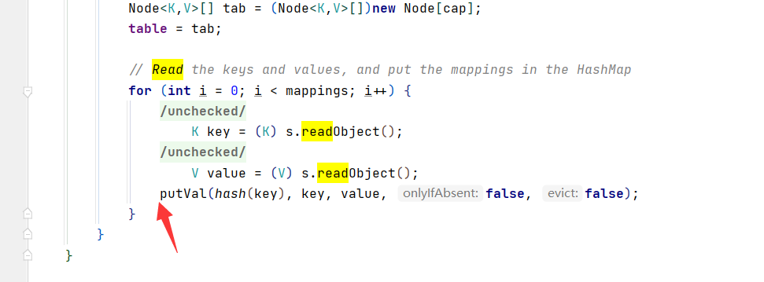
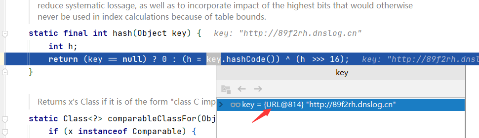
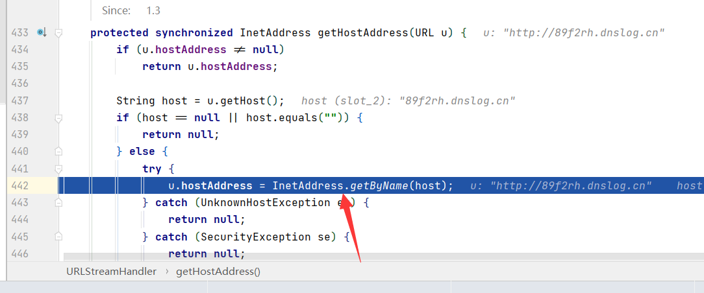
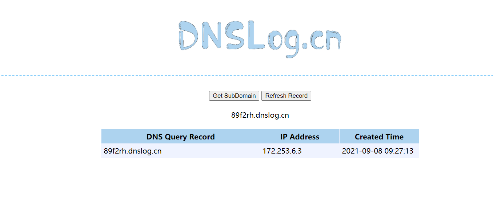

# 2.URLDNS

  故事的开始从URLDNS开启，因为是最简单最容易理解的反序列化虽然这个“利用链”实际上是不能利用”的，但因为其不存在第三方依赖，⾮常适合我们在检测反序列化漏洞时使用

 看看利用流程

```java
@Author：Y4tacker
*   Gadget Chain:
*     HashMap.readObject()
*       HashMap.putVal()
*         HashMap.hash()
*           URL.hashCode()
```

下面是ysoserial当中的代码

```java
URLStreamHandler handler = new SilentURLStreamHandler();
HashMap ht = new HashMap(); 
URL u = new URL(null, url, handler);
ht.put(u, url);
Reflections.setFieldValue(u, "hashCode", -1);
```


那么我们首先直奔HashMap的readObject方法,首先获取传入的key与val，后面可以看到将 HashMap 的键名计算了hash



继续跟入，调用了URL类的hashcode方法，因为这个key是⼀个 java.net.URL 对象




handler是URLStreamHandler对象的某个子类对象，这里是使用SilentURLStreamHandler


之后调用了getHostAddress


这里 InetAddress.getByName(host)就进行了一次DNS查询



这里也能看到效果


