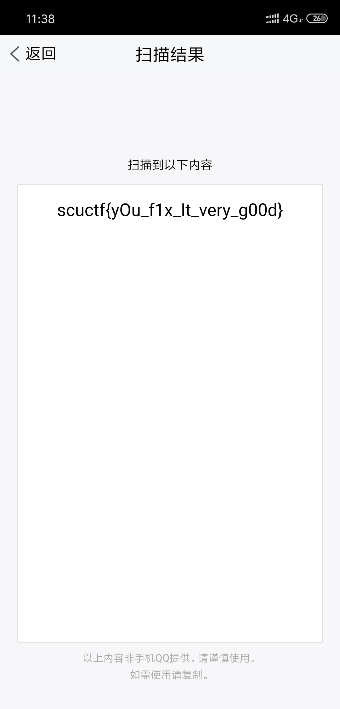

# MISC

## 婉姐姐的内存镜像

### 考查要点

1. 内存隐写

### 解题过程

1. 使用 Volatility 查看剪切板信息，发现一段 Base64 编码，但显示不全。
   
2. 使用十六进制编辑器打开文件，搜索这段 base64 的头`c2NlY3Rm`获得完整的 base64，解码获得 flag。

## 谁是协会最强的人

### 考查要点

1. 文件拼接

### 解题过程

打开文件发现是张图片，显示的是 JS 之父（所以放这张图是为提倡开源 ），直接拖进 HxD 看看有什么，拉到最后看到：

很明显的 base64，解码看见一段代码：

名字等于 des，value 就是密文，str 就是解密密钥，可以看到将解密密钥传进函数最后会得到 conclusion，观察函数，可以看到这是 rot13 加密，网上找到解密代码，解密 conclusion 得出 str=“abcdefgh”

最后 des 解密得出 flag:

flag{1810fc7a8e865dd5}

## stream

**考查要点：** ADS（数据交换流）

1. 下载题目后是一个 rar 压缩包

2. 打开该压缩包发现压缩包损坏

3. 使用二进制编辑器打开压缩包，发现 rar 文件头损坏

4. 补全 rar 文件头，使用 winrar 进行解压，得到一个文件夹，文件夹中有 flag.txt 文件

5. 根据题意 stream，可以猜测题目考查的是文件流，使用 lads 工具检测文件夹发现存在文件流

6. 在命令行中通过 notepad E:\documents\CTF 题目整理\第一届四川大学网络安全技能大赛\f7b44cfafd5c52223d5498196c8a2e7b\:realflag.txt 访问真正的 flag 文件

7. 得到 flag

## 流量分析

**考查要点：** USB 协议

1. 下载文件后发现是一个流量文件，使用 wireshark 打开

2. 使用 tshark 提取 usbdata.txt

3. 编写脚本

mappings = { 0x04:"A", 0x05:"B", 0x06:"C", 0x07:"D", 0x08:"E", 0x09:"F", 0x0A:"G", 0x0B:"H", 0x0C:"I", 0x0D:"J", 0x0E:"K", 0x0F:"L", 0x10:"M", 0x11:"N",0x12:"O", 0x13:"P", 0x14:"Q", 0x15:"R", 0x16:"S", 0x17:"T", 0x18:"U",0x19:"V", 0x1A:"W", 0x1B:"X", 0x1C:"Y", 0x1D:"Z", 0x1E:"1", 0x1F:"2", 0x20:"3", 0x21:"4", 0x22:"5", 0x23:"6", 0x24:"7", 0x25:"8", 0x26:"9", 0x27:"0", 0x28:"\n", 0x2a:"[DEL]", 0X2B:" ", 0x2C:" ", 0x2D:"-", 0x2E:"=", 0x2F:"[", 0x30:"]", 0x31:"\\", 0x32:"~", 0x33:";", 0x34:"'", 0x36:",", 0x37:"." }

nums = []

keys = open('usbdata.txt')

for line in keys:

​ if line[0]!='0' or line[1]!='0' or line[3]!='0' or line[4]!='0' or line[9]!='0' or line[10]!='0' or line[12]!='0' or line[13]!='0' or line[15]!='0' or line[16]!='0' or line[18]!='0' or line[19]!='0' or line[21]!='0' or line[22]!='0':

​ continue

​ nums.append(int(line[6:8],16))

keys.close()

output = ""

for n in nums:

​ if n == 0 :

​ continue

​ if n in mappings:

​ output += mappings[n]

​ else:

​ output += '[unknown]'

​ print( 'output :\n' + output)

4. 运行脚本，得到 flag

## find others

**考查要点：** png 文件头 二维码格式

1. 下载附件得到一张四分之一二维码

2. 根据题目意思需要得到另外其他三个部分，使用二进制编辑器打开图片，发现有其他三张图片的数据，但是 png 头损坏了，将其补全并提取出来，得到四张图片，拼接起来后反色得到二维码，使用手机扫描获得 flag

3. 二维码

4. flag

## audio

1. 下载附件，是一个音频文件，试听后发现是摩斯电码的声音

2. 可以直接用听的，也可以使用音频编辑软件比如 audition 打开后，将其波形转换成摩斯电码

3. 转换成摩斯电码

4. 使用工具或者在线工具转换成英文

