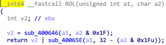
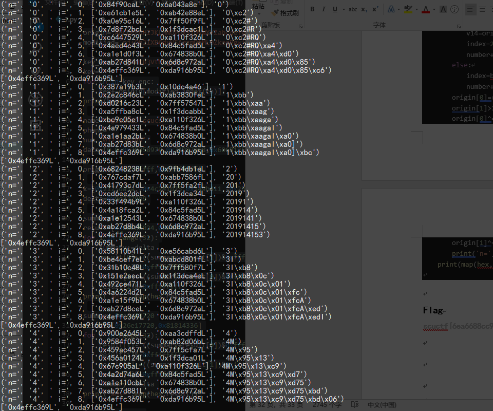

# REVERSE

## baby

### 考察要点

1. 斐波那契数列
2. 简单的异或加密

### 解题思路

主要是提取出 key，然后异或回去就完事了。

```python
table = [0x64, 0x6f, 0x64, 0x6f, 0x76, 0x2c, 0x13, 0x41, 0x6a, 0xcf, 0x9c, 0x26, 0x1b, 0xeb, 0x48, 0x6a, 0xa, 0x2b, 0xf3, 0x5c, 0x83, 0x54, 0x4e, 0x77, 0x2e, 0x47, 0x8c, 0x55]

def fibbo(n):
    a, b = 0, 1
    for i in range(n):
        a, b = b, a+b
    return a

for i, val in enumerate(table):
    print(chr((val ^ fibbo(i + 3)) & 0xff), end='')
```

## baby(dondayoo~战队 wp)


Windows 程序，先运行看看

乱输一个，直接退出。然后放进 IDA 里分析


看到这里没有 main 函数，搜索一下字符串 Input

点开 401030 函数，F5 反汇编，确定这个是 main 函数

这段代码可以直接看懂，401180 和 401130 分别是 printf 和 scanf，输入的字符串长度为 30

接下来 while 循环里做了一个异或操作，再判断是否和内存中的数据相等，相等则输入正确

变量 v3 是输入的字符串，v4 是 401000 生成的一个数据，进入 401000 分析

这是一个递归函数
一开始没看明白是做什么用的，用 python 对照着写了一下

很明显，函数返回斐波那契数列第 n 个值
所以目标就是让输入的字符串和斐波那契数列进行异或的值与 byte_41C7D4 相等

把这段数据 dump 出来，编写 python 脚本

```python
from libnum import n2s
def func(num):
    v1=num
    if(num==0 or num==1):
        return num
    v2=func(num-2)
    return (v2+func(v1-1))&2**8-1

arr=[]
for i in range(30):
    arr.append(func(i+3))

c='71 60 70 6B 79 73 59 0E 68 E6 DA 26 17 84 44 28 20 1F 9D 69 C0 53 63 45 1D 35 D9 1C E4 78'.split(' ')
c=list(map(lambda x:int('0x'+x,16),c))
flag=''
print(arr,c)
for i in range(30) :
    flag+=(n2s(arr[i]^c[i]))
print(flag)
```


## showme666

### 考察要点

1. 汇编理解
2. gdb 调试
3. patch

### 解题思路

这道题解题思路不唯一
最简单的是用 gdb 调试时，修改 rip 到 0x4006b6，然后继续运行，就可输出 flag

然后继续运行即可


## showme666(dondayoo~战队 wp)


先运行程序看看

是一个掷骰子程序，必须 5 个都是 6 点才能通过，分析程序类型

64 位 ELF 程序，用 IDA64 打开

随机数是用时间作为种子生成，不可控制
而且还有反作弊机制，666

这一段是最终结果部分，如果掷出 5 个 6 点，会调用 4006B6 函数，进入函数查看

其中有 putchar，说明该函数会输入字符，应该就是输出 flag。最重要的是该函数没有参数传入，所以只要动态调试直接将函数地址作为 IP 就能够执行该函数

一路执行到底，输出了 flag
要把 flag 换成 scuctf

## rcrcrc

### 考察要点

1. 算法分析
2. python 脚本编写

### 解题思路

这题主要考察逆向分析能力（纸上打个草稿，代码逆着写就行了

解题脚本如下(C 语言)

```c
#include <stdio.h>

unsigned int key[] = {0xF4A956BF, 0xBA568F3D, 0xD73A7F7C, 0x817F532B};
unsigned int T[] = {0xd24aaa79, 0x0bf82ac7, 0x6d08584c, 0x4b7703cf, 0xeb5a5436, 0x04fc4110, 0x07a6c88e, 0xcce3bc69, 0x67b581db, 0x42958bd7, 0xfde60589, 0xfbc21664, 0x56fc110f, 0x224189f6, 0x0da07f95, 0xfb0506e6, 0x1b02b4d0, 0x4c263256, 0x1bf60164, 0x79ad7531, 0xe0fa6867, 0xe06b6073, 0xd63b49ce, 0xa5d0d5fe, 0x89713ab9, 0x3258490d};

unsigned int func(unsigned int a, unsigned int b)
{
	return ((a >> (b & 0x1f)) | (a << (32 - b & 0x1f))) & 0xffffffff;
}

int main()
{
	int i, j;
	for(i = 2; i >= 0; i -= 2)
	{
		unsigned int a = key[i];
		unsigned int b = key[i + 1];

		for(j = 11; j >=0; j--)
		{
			b -= T[2 * i + 1];
			b = func(b, a) ^ a;
			a -= T[2 * i];
			a = func(a, b) ^ b;
		}

		key[i] = a - 0xd24aaa79;
		key[i + 1] = b - 0x0bf82ac7;
	}

	printf("%s", key);
}
```

## rcrcrc(dondayoo~战队 wp)


Linux 程序，先运行看看

程序没有任何输出，随便输入字符，程序退出，IDA64 打开分析

main 函数中有 scanf 和几个变量定义，最终判断四个变量值是否正确
先进入 400894 查看

其中 ROL 和部分变量的名字是我自己修改过的，点开 ROL 很容易分析出这是循环左移函数


看到这样的结构，再结合题目名字，基本上可以断定这是一个 RC5 加密程序，再进入 4006FC 查看

可以确定是 RC5 加密，一个分组是 int，也就是 32 位，做 12 轮循环，400894 是密钥扩展函数，4006FC 是加密函数，附两页 ppt


但与一般的 RC5 不同的是，程序每一轮使用的子密钥是一样的

循环变量 j 作为密钥数组索引，没有修改
要进行解密，首先要获得使用的子密钥，在这里无需对密钥扩展函数进行分析，直接在动态调试中从内存 dump 出各个子密钥即可

可以得到 4 个子密钥 0xd24aaa79,0x0bf82ac7,0xeb5a5436,0x04fc4110
按照密钥的使用顺序，编写解密程序

```python
import libnum
def ror(num,d):
    tmp=num>>(d&0x1f)
    return tmp|((num<<(32-(d&0x1f)))&2**32-1)

s=[0xd24aaa79,0x0bf82ac7,0xeb5a5436,0x04fc4110]
cipher=[0xf4a956bf,0xba568f3d,0xd73a7f7c,0x817f532b]
message=[]
for r in range(0,3,2):
    ld=cipher[r]
    rd=cipher[r+1]
    for rnd in range(12):
        rd=ror((rd-s[r+1])&2**32-1,ld)^ld
        ld=ror((ld-s[r])&2**32-1,rd)^rd
    rd=(rd-s[1])&2**32-1
    ld=(ld-s[0])&2**32-1
    message.append(libnum.n2s(ld))
    message.append(libnum.n2s(rd))
print(message)
```

运行得到

似乎不是可读的字符串，但确实都落在 ASCII 范围内，看了半天，注意到 linux 是小端位序，这个结果也是小端方式输出的，实际 flag 应该倒过来
`rc5_fking_boring`

## baha

### 考察要点

1. base64 算法逆向
2. 爆破哈希算法

### 解题思路

首先逆向 base64，使用随机数打乱了原始索引表，但是随机数结果使固定的，所以可以生成的新索引表也固定。
base64 解密脚本如下：

```python
key = 'pj+Oh2IXB6dyV5ArzmDtML0ZkeqPgwfvJbaSEHnxUY79K4Go3u/TC1sl8iFQWcNR'
T = 'kEjTmtB3VtHvgs51kl5v'
b = ''

for i in T:
    if i == '=':
        b += '000000'
        break
    tmp = key.find(i)
    tmp = bin(tmp)[2:]
    if not len(tmp) == 0:
        if len(tmp) < 6:
            for _ in range(6-len(tmp)):
                b += '0'
        b += tmp
j = 0
for i in range(0,len(b),8):
    print(chr(int(b[i:i+8], 2)), end='')
    j+=1
```

然后是爆破输入为 9 位数字的哈希函数，大佬们太强了，直接把函数复原了，预期解如下

```c
//#include "stdafx.h"
#include <windows.h>
#include <stdio.h>

typedef __int64 (*func)();

int main()
{
	//char * hmod = (char *)LoadLibraryA("C:\\Users\\hgy\\Desktop\\hxb\\reverse_1\\reverse.exe");
	FILE * fp;
	fp = fopen("./baha.exe", "rb");
	size_t len = 0;
	fseek(fp, 0, SEEK_END);
	len = ftell(fp);
	fseek(fp, 0, SEEK_SET);

	char * hmod = (char *)VirtualAllocEx(GetCurrentProcess(), 0, len, MEM_COMMIT, PAGE_EXECUTE_READWRITE);
	fread(hmod, len, 1, fp);
	func hash = (func)&hmod[0x560];

	unsigned long long res;
	char flag[0x30] = "b@sE2019_scucs_";
	for (flag[15] = '0'; flag[15] < '0' + 10; flag[15]++)
		for (flag[16] = '0'; flag[16] < '0' + 10; flag[16]++)
			for (flag[17] = '0'; flag[17] < '0' + 10; flag[17]++)
				for (flag[18] = '0'; flag[18] < '0' + 10; flag[18]++)
				{
					for (flag[19] = '0'; flag[19] < '0' + 10; flag[19]++)
						for (flag[20] = '0'; flag[20] < '0' + 10; flag[20]++)
							for (flag[21] = '0'; flag[21] < '0' + 10; flag[21]++)
								for (flag[22] = '0'; flag[22] < '0' + 10; flag[22]++)
									for (flag[23] = '0'; flag[23] < '0' + 10; flag[23]++)
									{
										unsigned int addr = (unsigned int)flag;
										__asm {
											mov ecx, addr
										}
										res = hash();
										if (res == 0x8181433626e17720)
										{
											printf("found: %s", flag);
											exit(0);
										}
									}
					printf("%s -- %#llx\n", flag, res);
				}
	return 0;
}

```

这里有个小坑是，哈希函数采用\_thiscall 调用的，所以我用的内联汇编给函数传的参数。不过大佬们直接复原了函数，也就没这些问题了 2333.

## baha(dondayoo~战队 wp)


Windows 程序，运行看看

两段输入，有错误提示，IDA 打开分析

没有 main 符号，搜索字符串 Welcome

进入 main 函数查看

其中部分变量名和函数名是自己修改过的，程序首先输入两个字符串，然后对第二次输入进行判断，进入 check_is_number 函数查看

比较明显的是与 48+9=57，也就是’9’的 ASCII 码，基本上可以得知这个函数是判断是否为数字字符串，但 strlen 还不太清晰

注意到这里的右移 6 位，&3F 等操作，再结合 abcdefg 变量

能够判断这是一个 base64 编码，而

其中的字符串是 base64 编码的结果
但是直接取出来进行 base64 解码发现并不是可读字符串，注意到`sub_401000()`

这个函数对 base64 编码表进行了打乱，上动态调试，直接 dump 出打乱的编码表

编写脚本，查表还原真正的 base64 编码

```python
origin='ABCDEFGHIJKLMNOPQRSTUVWXYZabcdefghijklmnopqrstuvwxyz0123456789+/'
modified='pj+Oh2IXB6dyV5ArzmDtML0ZkeqPgwfvJbaSEHnxUY79K4Go3u/TC1sl8iFQWcNR'

key_enc='kEjTmtB3VtHvgs51kl5v'
key=''
for ch in key_enc:
    key+=origin[modified.index(ch)]
print(key)
```


这个就是第一次输入的 name，接下来看 phone

这一段将 name 和 phone 连接到了一个字符串中，总长度是 24，所以 phone 的长度应该是 9
然后看最后的判断

进入函数查看


函数内有三段循环，第一段循环是 32 位常量的异或操作，第二段循环是查表操作，第三段循环特征比较明显，有>>5, ×16，也就是<<4 操作，并且有-0x61c88647= 0x9e3779b9 常量，是一个 tea 加密
结合题目名字 baha，ba 应该代表 base64，ha 我觉得应该是 hash，那么第二段循环应该是一个 hash 算法，而用查表方式的 hash 算法，一般就是 crc 了。仔细分析代码，首先取出第一个字符，与初始寄存器异或得到索引值，寄存器右移 8 位。通过索引查表得到某个值，再与寄存器异或，寄存器长度是两个双字，所以是一个查表法 crc64
第一段循环就是生成表的操作，同样直接在动态调试中 dump 出这张表即可

有了表后，需要逆向恢复出 9 个字节内容，因为 crc64 的长度是 8 字节，所以第一个字节只能猜测，范围也比较小，在数字字符范围内
恢复的方法参考了https://blog.csdn.net/dabang_007/article/details/48713659
因为正向计算时寄存器先逻辑右移 8 位，再与一个 8 字节异或，所以第一个字节与查表得到的值的第一个字节相等，利用这个可以得到表中这一个 8 字节字的索引。得到第一个 8 字节字后，寄存器先与这个字异或，再左移 8 位，然后重复第一次操作，一共可以得到 8 个 8 字节字的索引。
根据这些索引号，遍历所有的第一个字节，进行一次正向计算，约束后八个字节的输入必须使得查表时的索引号是所期望的值，就能得到每一种符合条件的输入。
Tea 的解密比较容易，将+改为-，顺序调换即可。
最后编写脚本

```python
origin='ABCDEFGHIJKLMNOPQRSTUVWXYZabcdefghijklmnopqrstuvwxyz0123456789+/'
modified='pj+Oh2IXB6dyV5ArzmDtML0ZkeqPgwfvJbaSEHnxUY79K4Go3u/TC1sl8iFQWcNR'

key_enc='kEjTmtB3VtHvgs51kl5v'
key=''
for ch in key_enc:
    key+=origin[modified.index(ch)]
print(key)

name='b@sE2019_scucs_'
phone=''
num='0123456789'
data=[0,0,0x30358979,0x7AD870C8,0x606B12F2,0xF5B0E190,0x505E9B8B,0x8F689158,0x9841B68F,0xC038E573,0xA8743FF6,0xBAE095BB,0xF82AA47D,0x358804E3,0xC81F2D04,0x4F50742B,0x6814FE75,0xAB28ECB4,0x5821770C,0xD1F09C7C,0x087FEC87,0x5E980D24,0x384A65FE,0x24407DEC,0xF05548FA,0x6B1009C7,0xC060C183,0x11C8790F,0x903E5A08,0x9EA0E857,0xA00BD371,0xE478989F,0x88BE6F81,0x7D08FF3B,0xB88BE6F8,0x07D08FF3,0xE8D57D73,0x88B81EAB,0xD8E0F40A,0xF2606E63,0x10FFD90E,0xBD301A48,0x20CA5077,0xC7E86A80,0x7094CBFC,0x4880FBD8,0x40A14285,0x32588B10,0xE0AA91F4,0xD620138F,0xD09F188D,0xACF86347,0x80C18306,0x2390F21F,0xB0F40A7F,0x594882D7,0x78EB277B,0x1618F6FC,0x48DEAE02,0x6CC08634,0x18803589,0xE3A8176C,0x28B5BCF0,0x997067A4,0x117CDF02,0xFA11FE77,0x2149567B,0x80C98EBF,0x7117CDF0,0x0FA11FE7,0x41224489,0x75796F2F,0x893D698D,0x3A291B04,0xB908E0F4,0x40F16BCC,0xE9567B7F,0xCF99FA94,0xD963F206,0xB5418A5C,0x79682177,0x513912C3,0x495DA80E,0x2BE1620B,0x19033385,0xA489F353,0x2936BAFC,0xDE51839B,0xE12997F8,0x9101F7B0,0xD11C1E81,0xEBD98778,0x8142850A,0x64B11620,0xB1770C73,0x1E6966E8,0x99C2B083,0x8719014C,0xA9F739FA,0xFDC17184,0xF9A9A271,0x72A9E0DC,0xC99C2B08,0x08719014,0x0183060C,0x4721E43F,0x31B68F75,0x3DF994F7,0x61E814FE,0xB29105AF,0x51DD9D87,0xC8497567,0xF1D64EF6,0x2C31EDF8,0xC1E3C78F,0x56E99D30,0x91BD5C04,0xD9810C68,0xA188D57D,0xA3597CA0,0x6997F879,0xEC09088B,0x59A27100,0x96D17843,0x09FCEA8B,0x19B9E91B,0x39C963F2,0x636199D3,0x7A6E2D6F,0xDF7ADABD,0x4A5BA416,0xA5A2AA75,0x1A053F9D,0x2ACA3B2D,0x2A30B6E4,0x50124BE5,0xE22F9BE0,0x1F423FCE,0xD21A1299,0x659A4F06,0x82448912,0xEAF2DE5E,0xB271006B,0x902AAE96,0x127AD31A,0x74523609,0x224F5A63,0x0E8A46C1,0x7211C1E8,0x81E2D799,0x42244891,0xFB3AA751,0x8A3B6595,0xB46AD37A,0xBA0EECEC,0xCEB2A3B2,0xEA507767,0x41DA32EA,0xDA65FE1E,0x3B024222,0xF2D042EE,0xA2722586,0xC2E5CB97,0xD8AA554E,0x92BB501C,0x57C2C416,0xA28ED965,0x2D1AB4DE,0x6A91F461,0x624AC0F5,0x5AA47D18,0x1892B03D,0x0AFAE693,0x97FA2165,0x3ACF6FEA,0xED2251AD,0x9AC4BC9B,0x095AC932,0xAAF135E2,0x7382B9FA,0xFAAFAE69,0xFCEA28A2,0xCA9A2710,0x8632586A,0x02850A14,0xC9622C41,0x32B0836D,0xB3BA5C89,0x62EE18E6,0x3CD2CDD1,0x52DB919F,0x460ABD19,0x6B12F26D,0x256B24CA,0x5B277B14,0x5FB35402,0x0B79E09F,0xD0DBC55A,0x3B4C69E6,0xAA03B592,0xF35344E2,0xE553C1B9,0xC366CD9B,0x9F8BB171,0x93385610,0x10E32029,0xA30DDF69,0x6A3B50E1,0x03060C18,0x8E43C87E,0x33338561,0xF49BB8B6,0x636D1EEA,0x7BF329EE,0x53589793,0x012B5926,0x9B47BA97,0x4E7B2D0D,0xAB7233EE,0x34A35DC5,0xFB2CA865,0xBBCBCC9D,0xCB19211C,0xC113BC55,0xE3AC9DEC,0x5863DBF1,0xD3991495,0x22BBAB39,0x83C78F1E,0xADD33A61,0xB3F20667,0xD70B4AA9,0x7BED2B63,0x985B3E82,0x4BD8A21A,0xE2834E4A,0x1B863991,0x6DEBDF12,0x2BB3B0E8,0x1733AFDA,0x8BB86399,0xF34B3745,0xBB8DEAE0,0x8993478D,0xEBD3716B,0x06FBD6D5,0xDBE6F812,0x7C23A61D,0x13F9D516,0x3373D236,0x23CC5C6F,0x49ABA2FE,0x7392C7E4,0xC6C333A6,0x43A74E9D,0xBC1B436E,0xAC4BC9B5,0x95AC9329,0x9C7E40CC,0xEF74E3E1,0xCC20DB47,0x601C72B9,0xFC15523E,0x1AC40271,0x340A7F3A,0x5594765A,0x043FF643,0x2F4C0692,0x54616DC8,0xA02497CA,0x6454E4B1,0xDAFCE702,0xC45F37C0,0x3E847F9D,0xF46ABEB9,0x445C0F55,0xA4342532,0xCB349E0D,0x9401AC4B,0xB1ECEEC5,0x5C1E814F,0xFEBC9AEE,0x6C2B0836,0x8464EA26,0x3C7593BD,0x0B0C7B7E,0x0C401AC4,0x71D40BB6,0x24F5A634,0xE8A46C12,0x14C02F4D,0x927C1CDA,0x449EB4C6,0x1D148D82,0x74AB3DBF,0x67CCFD4A,0xBCB410BB,0x289C8961,0x8C8199C2,0x5244F9A9,0xDCDF0249,0xDD2C68F1,0xECEA8B30,0xA7F41839,0x4CE15841,0x438C80A6,0x7CD4D138,0x3954F06E,0x2C8A4AB3,0xB63C6136,0x1CBFC3CA,0xCCE411FE,0xD4A0EECE,0x83B465D5,0xE49567B7,0xF96C151D,0xB4CBFC3C,0x76048445,0x84FE7545,0x0CDCF48D,0xBD3716B7,0x6FBD6D5E,0x8D029FCE,0x15651D96,0xDD5C0445,0x9A0D8CCE,0xED698D3C,0xE0D5FC06,0x2576A038,0xAF85882D,0x15432941,0xD55DF8E5,0x451DB2CA,0x5A3569BD,0x75283BB3,0x20ED1975,0xD523E8C2,0xC49581EA,0xE51661BB,0xBE4DF122,0xB548FA30,0x3125607A,0x857D7349,0x4BFD10B2,0x4D625E4D,0x04AD6499,0x7D57D734,0x7E751451,0x2D094CBF,0xF11D8509,0x1D3CC5C6,0x8BC5F5C1,0x35897936,0x12B59265,0x05BCF04F,0x686DE2AD,0x55E26BC4,0xE70573F5,0x65D7E2BD,0x9DDD033D,0xADC8CFB9,0xD28D7716,0x9DFD46C0,0xA85507DE,0xCDA3DD4B,0x273D9686,0xFD965432,0x5DE5E64E,0x5D9D8743,0xB99D7ED1,0x6DA80E3A,0xC3450E19,0x3DF695B1,0x4C2D9F41,0x0DC31CC8,0x36F5EF89,0xC5DC31CC,0x79A59BA2,0xF5E9B8B5,0x037DEB6A,0xA5B7233E,0x8C157A32,0x9582AA47,0xF6CD0AFA,0xD625E4DA,0x4AD64994,0xE6106DA3,0x300E395C,0xB64EF628,0xBF66A804,0x867B7F51,0xC5BED8CC,0x4E645255,0x8AEEACE7,0x7E51DB2C,0xF036DC2F,0x2E0F40A7,0x7F5E4D77,0x1E3AC9DE,0x05863DBF,0xBE311AAF,0xE1FEA520,0x8E0493D6,0x9B26D5E8,0xDE5A085D,0x144E44B0,0xEE6F8124,0x6E963478,0x2670AC20,0x21C64053,0x16452559,0x5B1E309B,0x461BBED2,0xD476A1C3,0x762E37AB,0xAEAED10B,0x5E9B8B5B,0x37DEB6AF,0x6EAE0222,0x4D06C667,0x3EF099A9,0xC26E573F,0x0EC510D0,0xB8B627F7,0xC6DA3DD4,0xF7E653DC,0xF6EFB4AD,0x8D3E2314,0xA6B12F26,0x0256B24C,0x9684A65F,0x788EC284,0x368F752E,0x9CF65A1B,0x06BAFC57,0xE62E2AD3,0x56E467DC,0x6946BB8B,0x66D1EEA5,0x139ECB43,0xAECEC3A1,0x5CCEBF68,0x9EFB4AD8,0x2616CFA0,0xCEA5D153,0xA97E5EF8,0xFE90582A,0xD3A62E30,0xC7593BD8,0xB0C7B7E3,0xF76CB2A1,0xCA1FC72B,0xA732292A,0x45775673,0x9707A053,0x3FAF26BB,0x5F188D57,0x70FF5290,0x6F2D042E,0x0A272258,0x3F739FA5,0x854FB300,0x0F4616DC,0xFF97C3C8,0xAF4DC5AD,0x1BEF5B57,0x9F784CD4,0x61372B9F,0xCF26D75F,0xEE5FBAC7,0xFF135E26,0x9487CA0F,0x370C7322,0xDBD7BE24,0x0739FA5B,0xA10FCEEC,0x576761D0,0x2E675FB4,0x6752E8A9,0x54BF2F7C,0x4FE75459,0xCDCF48D8,0x7FD2DD20,0xB7173810,0x2F8C46AB,0x387FA948,0x1FB9CFD2,0x42A7D980,0xD7A6E2D6,0x0DF7ADAB,0xE7936BAF,0x772FDD63,0xB7CDF024,0xF8474C3B,0x87F8795D,0x829F3CF3,0x27F3AA2C,0x66E7A46C,0x17C62355,0x1C3FD4A4,0x4798B8DE,0x935745FC,0x77AD31A7,0xE98F3534,0xBFB21CA3,0xA6DF411F,0x8F8795DA,0xDC0731D7,0xDFD90E51,0x536FA08F,0xEFEC8728,0x29B7D047]

k=[0x2175da3a,-0x4c241d25,0x149b411,-0x2b15395b]
delta=0x9e3779b9
summary=0xc6ef3720
result=[0x26e17720,0x81814336]
for r in range(32):
    result[1]-=((summary+result[0])&0xffffffff) ^ (((result[0]>>5)-0x2b15395b)&0xffffffff) ^ (((result[0]<<4)+0x149b411)&0xffffffff)
    result[1]&=0xffffffff
    result[0]-=((summary+result[1])&0xffffffff) ^ (((result[1]>>5)-0x4c241d25)&0xffffffff) ^ (((result[1]<<4)+0x2175da3a)&0xffffffff)
    result[0]&=0xffffffff
    summary-=delta
print('ans=',map(hex,result))

for ch in name:
    v14=origin[0]^ord(ch)
    index=2*(v14&0xff)
    origin[0]=(origin[0]>>8)+((origin[1]&0xff)<<24)
    origin[1]>>=8
    origin[0]^=data[index]
    origin[1]^=data[index+1]
print('origin=',map(hex,origin))

blks=[]
for r in range(8):
    e=result[1]&0xff000000
    for i in range(len(data)):
        if e==data[i]&0xff000000 and i%2==1:
            blks.append(i)
            result[1]=((((result[1]^data[i]))<<8)&0xffffffff)
            print(map(hex,result))
            result[0]=(result[0]^data[i-1])&0xffffffff
            result[1]+=(result[0]&0xff000000)>>24
            result[0]=(result[0]<<8)&0xffffffff
print(map(lambda x:hex(data[x]),blks))

for n in num:
    origin=[0x424fa357, 0x3f6a6fab]
    ind=[]
    number=''
    for i in range(len(blks)+1):
        if i==0:
            v14=origin[0]^ord(n)
            index=2*(v14&0xff)
            number+=n
        else:
            index=blks[len(blks)-i]-1
            number+=(chr((origin[0]^(index/2))&0xff))
        origin[0]=(origin[0]>>8)+((origin[1]&0xff)<<24)
        origin[1]>>=8
        origin[0]^=data[index]
        origin[1]^=data[index+1]
        print('n=',n,' i=',i,map(hex,origin),number)
    print(map(hex,origin))
```


可以看到 201914153 是符合条件的输入

随后 flag 即为`scuctf{b@sE2019_scucs_201914153}`
